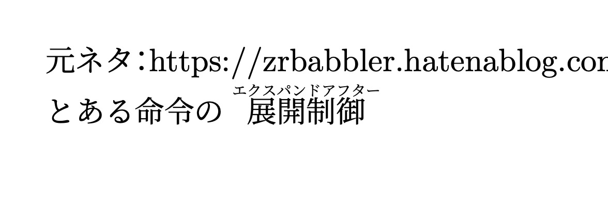
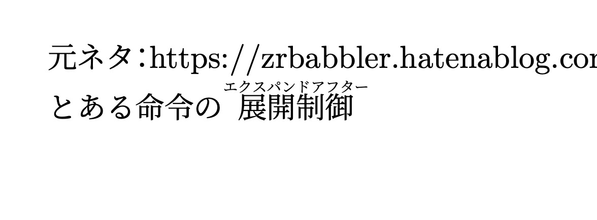
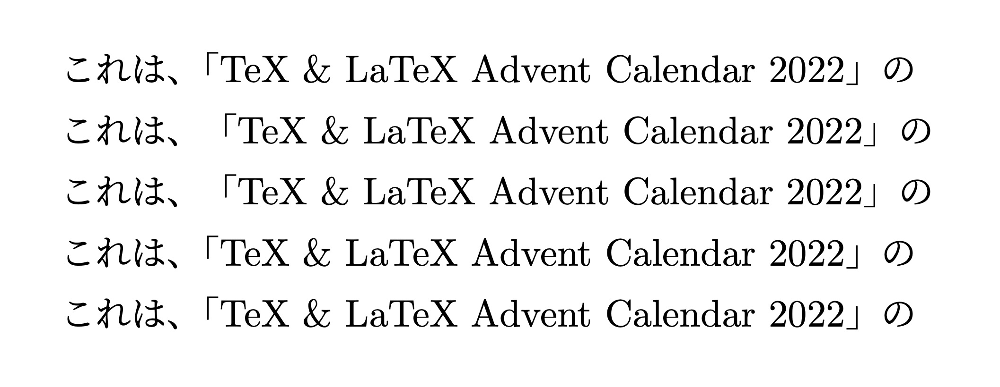
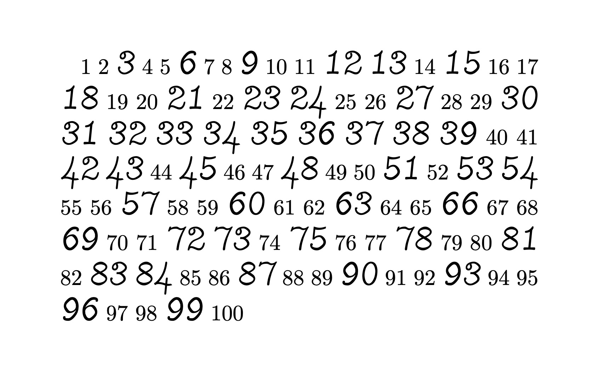



これは、「[TeX & LaTeX Advent Calendar 2022](https://adventar.org/calendars/7868)」の 6 日目の記事です。
昨日は[『スペースにまつわるエトセトラ』（ut さん）](http://texuttex.g2.xrea.com/AdventCal2022.html)でした。

今年の重点テーマは「やっぱりTeX言語(とか)しましょう！」です。
投稿された記事を読んでいて、「やっぱり TeX 言語は難しい」と思っている方も多いと思います。
この記事は重点テーマに反し、むしろそういった「普通の LaTeX ユーザ」のために書かれています。

この記事では、最近 LaTeX に追加された新機能である `\NewDocumentCommand` や関連した命令を用いて、複雑な命令を作る方法を解説していきます。
難解な TeX 言語や expl3 の知識は一切不要です。
追加パッケージも使わず、LaTeX が文書作成者（authors）向けに標準で提供している機能のみを用いて説明していきますのでご安心ください。
具体的には、以下のレベルの読者を対象としています：

- LaTeX で基本的な日本語文書が作れる
- 「パッケージを読み込む」という言葉の意味がわかる
- `\newcommand` を用いてオプション引数付きの命令を定義できる
- TeX 言語は死んでも学習したくない

`\newcommand` の使い方については ZR さんによる記事『[完全攻略！ LaTeX のマクロ定義](https://qiita.com/zr_tex8r/items/5067307890d36c0e4882)』を読めば必要な知識は身につきます。
それ以外については基本的な LaTeX の参考書をご覧ください。

なお、単に `\NewDocumentCommand` の使い方を知れればいいという方は、ZR さんの『[xparse パッケージでスゴイ LaTeX マクロを作ろう！](https://qiita.com/zr_tex8r/items/50168ad7087516c3e139)』を見れば十分でしょう。

リンク先の記事による `\NewDocumentCommand` 命令の説明は、この記事で説明する `\NewDocumentCommand` にも完璧に当てはまります。
xparse パッケージは従来より次世代 LaTeX の一環として開発されていましたが、最近、正式に LaTeX に導入されました。
現在では基本的に xparse パッケージの読み込みは不要です。
ただし、LaTeX 本体に導入するにあたって削除された、非推奨とされていた機能を使いたい場合はこの限りではありません。

この記事では `\NewDocumentCommand` の他に、同じく新機能である `\ExpandArgs` なども使用します。
以下では  TeX Live 2022 以降を前提とすることにします。
また、エンジンは pLaTeX を前提としますが、`\NewDocumentCommand` 自体は特定のエンジンに依存するものではないので他のエンジンへの移植も容易です。
これは、pLaTeX でしか動かないコードを他のエンジンに移植する手順と同じです。
「pLaTeX ってなに？」という人は普段から日本語を含む文書を作れていれば多分それで大丈夫です。

次以降で示すコードでは、プリアンブルなどは全て省略し、必要な箇所のみを提示します。
基本的には、以下のようにすれば動作するはずです：

```latex
%#!platex
\RequirePackage{plautopatch}
\documentclass[autodetect-engine,dvipdfmx]{jsarticle}
\begin{document}
% ここにコードをコピペしてくる
\end{document}
```

コード中で `⟨⟩` というカッコを用いることがあります。
この場合は、コードに実際に `⟨⟩` を書くわけでは**ありません**。
`⟨説明⟩` という記述は、「コードのその場所には `説明` に当てはまるような内容の任意のものが入りうる」ということを意味します。
たとえば、`\newcommand{⟨命令⟩}{⟨定義⟩}` という記述は、`\newcommand` の第 1 引数には命令が、第 2 引数には定義が入るということを意味します。
実際には `⟨命令⟩` や `⟨定義⟩` の意味については、すぐ後の本文で説明されることが多いでしょう。

不親切なことに、コードブロックで示すコードでは

- 前のコードブロックで定義した命令を未定義なものとして扱っている
- 前のコードブロックで定義した命令を定義済みとして扱っている

という状況が混在しています。
個別のコードをコピペしただけで動作することはまれで、

1. とりあえず使いたい命令が定義されているコードブロックをコピペする
2. `! Undefined control sequence.` などのエラーがでたら、そこに表示されている命令の定義を探してそれもコピペする
    - ただし、そのコードブロックが「悪い例」について説明してるものではないことを確認する必要がある

という手順を踏む必要があります。
これでは不便なので、この記事全体の最後に必要な命令の定義を過不足なく集めたコードブロックを置いておきます。
必要な方はそこからコピペしてください。

この記事で示すコードは、全て無保証・パブリックドメインとします。
好きにコピペして使ってください。
この記事自体は [CC BY-SA 4.0](https://creativecommons.org/licenses/by-sa/4.0/) とします。

コメントは歓迎します。
おかしなところや改善案、わかりにくい箇所の指摘なども気楽にコメントしてください。

記事を読んでいてよくわからないところがあったら、少し先まで読んでみると詳しい説明がある……、かもしれません。

<details markdown="block"><summary>時間がない人に向けて、各章の概要を説明</summary>

この記事は以下のような構成になっています：

1. 復習　`\newcommand` の使い方
2. 基礎　`\spacedruby` を作る
3. 閑話　`\ruby` も作ってみる
4. 応用　`\ProcessArgument`
5. 補足　デバッグの方法
6. 集大成　`\FizzBuzz`

「復習」では `\newcommand` によって定義された命令の挙動を細かく調べます。
意外と知られていないながらこの記事を読むにあたって重要である性質が多く出てくるので、`\newcommand` をわかっているつもりでもとりあえず眺めてみましょう。

「基礎」では `\NewDocumentCommand` 命令の基本的な使い方を説明した後、`\UseName` や `\ExpandArgs` についても触れます。
引数に応じて条件分岐する方法も扱います。

「閑話」ではルビを題材として、LaTeX の知識だけで意外となんとかなるという例を提示します。
忙しければ飛ばして構いません。

「応用」では命令に値を格納してそれを後から取り出すことについて、課題とその解決方法を考えます。
必ずしも必要ではありませんが、「集大成」の前に読むことを推奨します。

「補足」は文字通りです。読まなくても問題ありません。

「集大成」ではこの記事のこれまでの内容を踏まえ、FizzBuzz というプログラミングの課題を解くアイデアを示します。
自信がある人は内容を読む前に「LaTeX で」FizzBuzz する方法を考えてみましょう。
「集大成」といっていますが、『[xparse パッケージでスゴイ LaTeX マクロを作ろう！](https://qiita.com/zr_tex8r/items/50168ad7087516c3e139)』を読んでいればこの節を理解するのに必要な知識自体は身につくはずです。
しかしながら、知識とは別に「複雑な命令を作るためのテクニック」がわかっていることが望ましいため、最低でも「基礎」の内容を理解してから読むことを強く推奨します。

</details>

<p></p>

ちょっと複雑な命令を作ってライバルに差をつけよう！

# 復習　`\newcommand` の使い方

`\newcommand` を用いると命令をユーザ自身が定義できることになっています。
しかし、あなたは本当にユーザ定義命令を理解していますか？
この節では、ユーザ定義命令の詳しい挙動を確認していきます。

## 置き換えと最左戦略

`\newcommand` などによって定義された命令（Command）は、その命令が見つかるとその定義に置き換えられます。
これは、単純な置き換えです。
いったいどういうことでしょうか。例を見てみましょう。

```latex
\newcommand{\yama}{山}
\newcommand{\reason}{そこに\yama があるからだ}

\renewcommand{\yama}{エベレスト}

\reason % -> そこにエベレストがあるからだ
```

`\reason` は「そこに山があるからだ」ではなく「そこにエベレストがあるからだ」に置き換えられます。
これは、`\newcommand` によって `\reason` が定義されたときに `\yama` の中身が考慮されているわけではないからです。
`\reason` は単純に `そこに\yama があるからだ` への置き換えとして定義され、その置き換えが終わった後に `\yama` が `エベレスト` に置き換えられます。

複数の命令がある場合は一番左のものから順に置き換えられます。

`\reason` が置き換えられる流れを追ってみます。

```latex
\reason
% \reason が置き換えられる

そこに\yama があるからだ
% \yama が置き換えられる

そこにエベレストがあるからだ
```

もう 1 つ例を見てみましょう。

```latex
\newcommand*{\idai}[3]{#1なる#2#3}
\idai{偉大}{世界統制官}{閣下}

\newcommand*{\tousei}[1]{\idai{偉大}{世界統制官}{#1}}
\tousei{閣下}

\newcommand*{\Tousei}{\idai{偉大}{世界統制官}}
\Tousei{閣下}
```

ここでは `\Tousei` の定義に注目してみましょう。
`\Tousei` の定義は `\idai{偉大}{世界統制官}` となっています。
`\idai` は引数（argument）を 3 つとる命令のはずですが、この定義の時点ではそのうち 2 つの引数しか与えられていません。
`\Tousei` 自体は引数を取らない命令として定義されていますが、`\Tousei{閣下}` として `\Tousei` を使うと `閣下` が `\idai` の 3 つ目の引数として与えられます。

これは、

- ユーザ定義命令は単純な置き換えである
- ユーザ定義命令を定義する時点では、その中身は考慮されない

という性質によるものです。

`\tousei` と `\Tousei` が置き換えられる流れを追ってみます。
命令が置き換えられる様子を説明するときは、以下のような規則を使うことにします：

- 以下のどれにも当てはまらない行：命令の置き換えを追う過程でのその時点での状況
- 空行：命令の置き換えの過程を区切る。空行を挟んで上のコードで命令をその定義に置き換えると、空行を挟んで下のコードになることを意味する
- `%` で始まる行：コメント
    - とくに、`#⟨n⟩ <- ⟨引数⟩` という記述は、第 `⟨n⟩` 引数に `⟨引数⟩` が渡されるということを意味する

```latex
\tousei{閣下}
% #1 <- 閣下

\idai{偉大}{世界統制官}{閣下}
% #1 <- 偉大
% #2 <- 世界統制官
% #3 <- 閣下

偉大なる世界統制官閣下
```
```latex
\Tousei{閣下}
% `\Tousei` は引数を取らない

\idai{偉大}{世界統制官}{閣下}
% #1 <- 偉大
% #2 <- 世界統制官
% #3 <- 閣下

偉大なる世界統制官閣下
```

では、次の例はどうなるでしょうか。

```latex
\newcommand{\kakka}{{偉大}{世界統制官}{閣下}}
\idai\kakka は、
```

- 命令が複数ある場合は左にあるものから置き換えられる

という性質を理解していれば、そんなに難しくないですね。

```latex
\idai\kakka は、
% #1 <- \kakka
% #2 <- は
% #3 <- 、

\kakka なるは、
% \kakka 置き換える

{偉大}{世界統制官}{閣下}なるは、
```

`偉大なる世界統制官閣下は、` になると思った人、残念でした。
`\kakka` よりも `\idai` の方が左にあるので、`\kakka` が置き換えられるよりも先に `\idai` が置き換えられます。

## オプション引数の性質

この節の内容は、ZR さんによる記事『[完全攻略！ LaTeX 命令の“引数の規則”](https://qiita.com/zr_tex8r/items/6a132bef73f1859c805c)』のものと同じです。

オプション引数は、LaTeX においては慣習的に `[]` のカッコによって表されます。
ここでは `[]` や `<>` などの、`{}` 以外のカッコに共通した性質を確認していきます。

以下のコードでは、どこまでが `\showargument` の引数になるでしょうか。

```latex
\newcommand{\showargument}[1][]{「#1」}
\showargument [外側[内側{波カッコのなか]]][}内側]外側]
```

ここでは、`[]` を始めとした特殊なカッコの引数に共通した以下の性質が重要となります：

- `[]` は入れ子にできない。最初に `]` が現れたところまでが引数となる
- ただし、`{}` の中にある `]` は飛ばされる。これは、`{}` は一体として扱われるという性質によるものである
    - したがって、`[]` の引数の中にある `{` と `}` の数は等しくなる
- `{}` の中などでも `[` と `]`の数は釣り合っている必要はない
    - 実は、`[` や `]` は特殊文字ではない。したがって本文に直接 `[]` と書いて `[]` を出力することができる

上でいう `[` と `]` は `{` と `}` 以外の任意の特殊なカッコに置き換えても成り立ちます。

```latex
\showargument [外側[内側{波カッコのなか]]][}内側]外側]
% #1 <- 外側[内側{波カッコのなか]]][}内側

「外側[内側{波カッコのなか]]][}内側」外側]
```

また、このような特殊なカッコには、以下の性質もあります：

- 引数の一番外側が `{}` で覆われている場合、その `{}` が消滅する

例を示します。

```latex
\newcommand{\showargument}[1][]{\taketwo #1}
\newcommand{\taketwo}[2]{「#1」「#2」}

\showargument [{12345}6]     % -> 「12345」「6」
\showargument [{123456}]     % -> 「1」「2」3456
\showargument [{{12345}6}]   % -> 「12345」「6」
```

`\showargument [{123456}]` では、`[]` の内側の `{123456}` は一番外側が `{}` で覆われています。
したがってこの `{}` は消えて、`123456` が引数となります。

```latex
\showargument [{123456}]
% #1 <- 123456
% 外側の `{}` が消えた

\taketwo 123456
% #1 <- 1
% #2 <- 2

「1」「2」3456
```

## `{}` の省略と空白

他にも、引数の性質として以下のものがあります。

- `{}` の引数においては、引数の中身が空白でない 1 文字または 1 命令からなる場合は、`{}` を省略できる
- `{}` や `[]` などの引数をとる過程においては、その引数の前にある空白文字 <code> </code> は全て無視される。

なお、これらの性質は `\newcommand` などによってつくられたユーザ定義命令では成り立ちますが、特殊な定義の仕方をされた命令では成り立たない場合があります。

例を示します：

```latex
\newcommand{\showargument}[2]{「#1」「#2」}
\showargument {1234}5678  % -> 「1234」「5」678
% `{}` が省略され、次の 1 文字である `5` が引数となった
\showargument 12345678    % -> 「1」「2」345678
\showargument 1 2345678   % -> 「1」「2」345678
% `2` の前にある空白が無視されて `2` が引数となった
\showargument 1 { }2345678 % -> 「1」「 」2345678
% `{ }` の前にある空白が無視されて ` ` が引数となった
```

# 基礎　`\spacedruby` を作る

ここでは題材として、[TeX フォーラム](https://oku.edu.mie-u.ac.jp/tex/mod/forum/discuss.php?d=2899)で質問されていたルビ命令を用いて説明していきます。
これを選んだのは、ZR さんが [expl3 と `\NewDocumentCommand` を用いて実装しているの](https://gist.github.com/zr-tex8r/681b30cacbcc80180272750a6d984435)をみつけ、これなら expl3 に手を出さなくてもなんとかなるよなと思ったからです。

以下では「親文字」という用語が登場します。
これは、ルビをつけるときに「ルビをつけられる側の文字」を指す言葉です。
たとえば `\ruby{明朝体}{みんちょうたい}` とすると、ルビは `みんちょうたい` ですが、親文字は `明朝体` です。

簡単にいうと、`\spacedruby{明 朝 体}{みん ちょう たい}` とすると、`\ruby{明}{みん}\ruby{朝}{ちょう}\ruby{体}{たい}` としたのと同じ組版結果を得られるようにしたいという要望です。
要件を明確にしておきましょう：

- `\spacedruby` は第 1 引数に `⟨親文字リスト⟩`、第 2 引数に `⟨ルビリスト⟩` をとる
    - `⟨親文字リスト⟩` は親文字にしたい文字 `⟨親文字1⟩`、`⟨親文字2⟩`、…を空白区切りで並べたものである
    - `⟨ルビリスト⟩` はルビにしたい文字 `⟨ルビ1⟩`、`⟨ルビ2⟩`、…を空白区切りで並べたものである
- `\spacedruby{⟨親文字リスト⟩}{⟨ルビリスト⟩}` は `\ruby{⟨親文字1⟩}{⟨ルビ1⟩}`、`\ruby{⟨親文字2⟩}{⟨ルビ2⟩}`、…を並べたのと同じ組版結果を得る

## `\NewDocumentCommand` の使い方

`\NewDocumentCommand` はその名の通り、文書作成用の命令（document command）を新しく定義するための命令です。
以下のように使います：

```latex
\NewDocumentCommand ⟨命令⟩{⟨引数仕様⟩}{⟨定義⟩}
```

`⟨引数仕様⟩` では `⟨命令⟩` が持つ引数の仕様（argument specification）を記述します。
`⟨定義⟩` は `\newcommand` と同じで、`⟨命令⟩` は引数をとった後、その `⟨定義⟩` に置き換えられます。
たとえば、以下の `\kami` と `\Kami` 、`\idai` と`\Idai` はそれぞれまったく同じように使えます。

```latex
\newcommand*{\kami}[1]{#1は神だ}
\NewDocumentCommand\Kami{m}{#1は神だ}

\newcommand*{\idai}[3]{#1なる#2#3}
\NewDocumentCommand\Idai{m m m}{#1なる#2#3}
```

上で、`\Kami` の定義では、`m` が引数仕様となります。
`m` は必須引数を 1 つとることを意味します。
このような意味を持つ文字を、この記事では「引数指定子」と呼ぶことにします。
任意の引数指定子 `X` について、`X` によって指定された引数のことを「`X` 型引数」（`X`-type argument）といいます。
引数仕様は引数指定子を 0 個以上 9 個以下だけ並べたものです。
`\Idai` では必須引数を 3 つとるので、`m` を 3 つならべた `m m m` を引数仕様としています。
並べるときには空白をいれてもいれなくても同じですが、ここでは見やすさのために入れています。

今作ろうとしている `\spacedruby` は、必須引数を 2 つ取る命令でした。
したがって、定義は後で考えることにして、引数仕様は以下のようにすればよさそうです：

```latex
\NewDocumentCommand \spacedruby { m m }
  {%
    % 後で考える
  }
```

上のコードでは、2 行目の行末で `%` をつけて行末をコメントアウトしています。
普段日本語を書いているとあまり意識しませんが、そもそも TeX においては改行と空白は基本的に等価です。
したがって、この `%` を忘れると、`\spacedruby` がその定義に置き換えられたときに、先頭に不要なスペースが出現することになります。
これは、LaTeX 初心者がやりがちなミスのひとつですので、気を付けましょう。

一方、1 行目、4 行目の行末はコメントアウトされていません。
それどころか 1 行目では、`\NewDocumentCommand` と `\spacedruby` の後ろに不要な空白が入っています。
私が示すコードでは、このように空白をいれても出力には影響しない場所と影響する場所を判定し、余計な空白や改行を多く入れています。
これは、余計な行末コメントアウトはしない方が美しいし、引数の区切りには空白を入れた方が読みやすいと考えているからですが、初心者にはどこがコメントアウトが必要な行末かを判定することは難しいでしょう。
そのような場合には、まよわず全ての行末をコメントアウトして、余計な空白もいれないでください。
LaTeX の標準の文書作成者向けの機能のみを使っている場合、行末をコメントアウトしてはいけない場面は（空白を組版結果に出力したい場合を除き）ありません。

<div markdown="block" class="warn">

`\NewDocumentCommand` では `end` で始まる命令も定義できます。
実は、`\newcommand` では `end` で始まる命令は定義できません。

```latex
% \endUndefined は未定義
\newcommand{\endUndefined}{}% エラー
```

これは、`end` で始まる命令名は LaTeX に予約されているからです。
`\NewDocumentCommand` ではエラーは出ませんが、なぜ `\newcommand` でエラーが出るようになっているか知らないうちは、`end` で始まる命令名は使わないのが穏当でしょう。

同様に、`\NewDocumentCommand` では `\relax` という命令を定義しようとしてもエラーが出ませんが、これも行うべきではありません。

`\protect` は `\newcommand` でもエラーが出ませんが、定義してはいけません。

</div>

## 引数の加工

`\spacedruby` では、与えられたそれぞれの引数を空白を区切りとして分解する必要があります。
そこで、引数プロセッサ（argument processor）の出番です。
引数プロセッサを用いると、引数を加工してから使うことができます。
引数仕様で引数指定子の前に `>{⟨プロセッサ⟩}` と書くことで、その引数に対して `⟨プロセッサ⟩` を適用できます。
といってもよくわからないでしょうから、例を示すことにします。

`\SplitList{⟨文字列⟩}` は、引数を `⟨文字列⟩` を区切りとして分解し、それぞれを `{}` で囲むという加工を行うプロセッサです。
文字列には文字の他に命令も含めることができますが、`{` や `}` などの特殊文字を含めてはいけません。

```latex
\NewDocumentCommand \Sumomo { >{\SplitList{,}} m }
  {%
    \SumomoI #1%
  }
\NewDocumentCommand \SumomoI { m m m }
  {%
    #1も#2も#3のうち
  }
\Sumomo{すもも,もも,もも}% -> すもももももももものうち
```

`\SumomoI` は `\Sumomo` の内部でのみ用いられる命令です。
別にどんな名前でもよいのですが、

- LaTeX 本体やパッケージが定義する命令の名前とかぶらない
- `\Sumomo` の下請け命令だということがわかりやすい

という 2 つの条件を満たす名前として、ローマ数字の 1 を意味する I をつけた `\SumomoI` にしました。

`\Sumomo` が置き換えられる流れを追ってみることにします。

```latex
\Sumomo{すもも,もも,もも}
% #1 <- すもも,もも,もも
% が引数プロセッサにより変化し、
% #1 <- {すもも}{もも}{もも}

\SumomoI {すもも}{もも}{もも}
% #1 <- すもも
% #2 <- もも
% #3 <- もも

すもももももももものうち
```

なお、引数プロセッサは複数個指定することも可能です。
複数個指定する場合は適用したい順に `>{⟨プロセッサ⟩}` を複数個並べます。
標準で用意されている引数プロセッサを以下に簡単にまとめておきます：

|引数プロセッサ|説明|
|:--|:--|
|`\SplitList{⟨文字列⟩}`|`⟨文字列⟩` で分割したそれぞれの要素を `{}` に入れたものに置き換える|
|`\SplitArgument{⟨数⟩}{⟨文字列⟩}`|`\SplitList` と同じだが、引数中に出現しうる `⟨文字列⟩` の最大の `⟨数⟩` を指定できる。引数は常に `⟨数⟩`+1 個の `{}` で囲まれた要素に分割される。`⟨文字列⟩` が `⟨数⟩` より多くある場合はエラーになり、少ない場合には残りの引数には `-NoValue-` マーカが与えられる|
|`\TrimSpaces`|引数の一番外側にある空白を取り除く。たとえば `␣TeX␣Live␣` は `TeX␣Live` になる（`␣` は空白の意）|
|`\ReverseBoolean`|引数の真偽値、すなわち `\BooleanTrue` と `\BooleanFalse` を逆にする|

`-NoValue-` マーカについては[後で][-NoValue-]説明します。

もうおわかりですね。`\spacedruby` では引数プロセッサとして `\SplitList{ }` を指定することで、引数を空白区切りで分割します。
もちろんこれだけでは不十分で、以下の課題を解決する必要があります

- 引数が何個の要素に分割されるかわからない
- 親文字とルビについて、分割された要素のそれぞれの先頭を同時にとってきて `\ruby` の引数に入れなければならない

## 繰り返しと条件分岐

すぐ上で提示した 2 つの課題のうち、ここでは何個あるかわからない引数を処理する方法について検討します。
タイトルが答えになっていますが、

- 引数がある限り処理を続ける繰り返し
- 全ての引数に対して処理を終えたことを検出する条件分岐

について考えます。

以下のような命令 `\GomiRuby` を作ってみましょう：

- `\GomiRuby{⟨親文字リスト⟩}` は、`⟨親文字リスト⟩` を空白で分割したそれぞれの `⟨親文字⟩` に対して、`\ruby{⟨親文字⟩}{ゴミ}` としたのと同じ結果を得る。

繰り返しを行うには、命令を再帰的にします。
再帰的とは、命令を定義に置き換えていったときにその命令がまた現れるということです。
とりあえず例を見てください：

```latex
\NewDocumentCommand \GomiRuby { >{\SplitList{ }} m }
  {%
    \GomiRubyI #1%
  }
\NewDocumentCommand \GomiRubyI { m }
  {%
    \ruby {#1} {ゴミ}%
    \GomiRubyI
  }
\GomiRubyI{金 権力}に用はない！
```

`\GomiRubyI` の中で再び `\GomiRubyI` を呼び出しているのが再帰の部分です。
いうまでもなく、このコードは不正です。

```latex
\GomiRuby{金 権力}に用はない！
% #1 <- {金}{権力}

\GomiRubyI {金}{権力}に用はない！
% #1 <- 金

\ruby{金}{ゴミ}\GomiRubyI{権力}に用はない！
% \GomiRubyI を置き換えます
% #1 <- 権力

\ruby{金}{ゴミ}\ruby{権力}{ゴミ}\GomiRubyI に用はない！
% \GomiRubyI を置き換えます
% #1 <- に

\ruby{金}{ゴミ}\ruby{権力}{ゴミ}\ruby{に}{ゴミ}\GomiRubyI 用はない！
% あれれ……
```

<div markdown="block" class="warn">

上ではあたかも `\ruby` よりも先に `\GomiRubyI` が置き換えられるかのような書き方をしていますが、これは説明のための嘘です。
実際には `\ruby` が先にその定義に置き換えられます。
以降でも同じです。

</div>

意図しない「に」にまでルビが振られてしまいます。
それどころかこのループは空行か `\par` かファイルの終わりまで続き、しまいにはエラーを出すことでしょう。
無限ループにしないために、条件分岐を用いてループすべき部分が終わったことを検出する必要があります。

ここでは `s` という引数指定子を用いて条件分岐をしましょう。

`\newcommand` と `\newcommand*` のように、LaTeX には `*` の有無で挙動が変わる命令があります。
s 型引数は `*` の有無を判定し、`*` がある場合には引数が `\BooleanTrue` に、ない場合には `\BooleanFalse` になります。
`{*}` と `*` は区別して扱われます。

`\BooleanTrue` を判定するには `\IfBooleanTF` を用いて `\IfBooleanTF{⟨引数⟩}{⟨真⟩}{⟨偽⟩}` のようにします。
これは `⟨引数⟩` が `\BooleanTrue` である場合は `⟨真⟩` に、`\BooleanFalse` である場合は `⟨偽⟩` に置き換えられます。
TF は True / False の略です。`⟨真⟩` だけを指定する `\IfBooleanT` や `⟨偽⟩` だけを指定する `\IfBooleanF` もあります。

```latex
\NewDocumentCommand \Star { s m }
  {%
    \IfBooleanTF {#1}
      {%
        #2はスターです。
      }
      {%
        #2はスターではありません。
      }%
  }
\Star{総理大臣}%    -> 総理大臣はスターではありません。
\Star{*}%           -> *はスターではありません。
\Star*{ゆきだるま}% -> ゆきだるまはスターです。
```

これを利用して `\GomiRuby` を作り直してみましょう。
`\GomiRuby` の定義の最後に `*` を置くことでループの終わりを検知します。

なお、`\ruby` 命令は LaTeX に標準で準備されていないので、okumacro パッケージを読み込むなどして準備してください。
動作を確認するだけであれば、`\NewDocumentCommand\ruby{mm}{「#1」（#2）}` みたいな雑に定義したものでよいでしょう。

```latex
\NewDocumentCommand \GomiRuby { >{\SplitList{ }} m }
  {%
    \GomiRubyI #1*%
  }
\NewDocumentCommand \GomiRubyI { m s }
  {%
    \ruby {#1} {ゴミ}%
    \IfBooleanF {#2} {\GomiRubyI}%
  }
\GomiRuby{金 権力}に用はない！
```

置き換えの様子です。


```latex
\GomiRuby{金 権力}に用はない！

\GomiRubyI{金}{権力}*に用はない！
% #1 <- 金
% #2 <- \BooleanFalse

\ruby{金}{ゴミ}\IfBooleanF{\BooleanFalse}{\GomiRubyI}{権力}*に用はない！
% \IfBooleanF を置き換える
% #1 <- \BooleanFalse
% #2 <- \GomiRubyI

\ruby{金}{ゴミ}\GomiRubyI{権力}*に用はない！
% \GomiRubyI を置き換える
% #1 <- 権力
% #2 <- \BooleanTrue

\ruby{金}{ゴミ}\ruby{権力}{ゴミ}\IfBooleanF{\BooleanTrue}{\GomiRubyI}に用はない！
% \IfBooleanF を置き換える
% #1 <- \BooleanTrue
% #2 <- \GomiRubyI

\ruby{金}{ゴミ}\ruby{権力}{ゴミ}に用はない！
```

ちなみに、`\ProcessList{⟨引数⟩}{⟨命令⟩}` を使うとこんなことをしなくても `\GomiRuby` が定義できます。
`\ProcessList` は `⟨引数⟩` を引数として認識できる単位で分割し、そのそれぞれを `⟨命令⟩` に `⟨命令⟩{⟨分割後の引数⟩}` として適用します。
したがって、`\SplitList` された引数については、分割した後のそれぞれの要素に対して `⟨命令⟩` が適用されることになります。

```latex
\NewDocumentCommand \GomiRuby { >{\SplitList{ }} m }
  {%
    \ProcessList {#1}{\GomiRubyI}%
  }
\NewDocumentCommand \GomiRubyI { m }
  {%
    \ruby {#1}{ゴミ}%
  }
\GomiRuby{金 権力}に用はない！
```

## 指定された位置までとってくる

繰り返しの方法を学習したところで、親文字だけではなくルビに対してもループを適用する方法を考えましょう。
親文字リストの先頭をとってくるのと同時にルビリストの先頭をとってこなければいけません。
どうにかして

```latex
\spacedruby{明 朝 体}{みん ちょう たい}

\spacedrubyI {明}{朝}{体}*{みん}{ちょう}{たい}*
% #1 <- 明
% #2 <- {朝}{体}
% #3 <- みん

\ruby{明}{みん}\spacedrubyI{朝}{体}*{ちょう}{たい}*
```
のような形に持ち込めないでしょうか。

親文字の先頭である `{明}` を引数とした後、残りの `{朝}{体}` をそれ以降の `{みん}{ちょう}{たい}` と分離してとってくるためにはどうすればよいでしょう。
ここで、オプション引数の `[]` は `{}` と違い、均衡がとれている必要がないという性質を思い出しましょう。
オプション引数を表す引数指定子は `O` で、`O{⟨既定値⟩}` のように使います。

```latex
\NewDocumentCommand \spacedruby { >{\SplitList{ }} m >{\SplitList{ }} m }
  {%
    \spacedrubyI #1*]#2*]%
  }
\NewDocumentCommand \spacedrubyI { s m }
  {%
    \IfBooleanTF {#1}
      {%
        \spacedrubyIII [%
      }
      {%
        \spacedrubyII {#2}[%
      }%
  }
\NewDocumentCommand \spacedrubyII { m O{} s m }
  {%
    \IfBooleanF {#3}
      {%
        \ruby {#1}{#4}%
        \spacedrubyI #2]%
      }%
  }%
\NewDocumentCommand \spacedrubyIII { O{} }
  {}
\spacedruby{明 朝 体}{みん ちょう たい}
```

置き換えの流れを見てみましょう。

```latex
\spacedruby{明 朝 体}{みん ちょう たい}

\spacedrubyI {明}{朝}{体}*]{みん}{ちょう}{たい}*]
% #1 <- \BooleanFalse
% #2 <- 明

\IfBooleanTF{\BooleanFalse}{\spacedrubyIII[}{\spacedrubyII{明}[}%
{朝}{体}*]{みん}{ちょう}{たい}*]
% \IfBooleanTF を置き換え

\spacedrubyII{明}[{朝}{体}*]{みん}{ちょう}{たい}*]
% #1 <- 明
% #2 <- {朝}{体}*
% #3 <- \BooleanFalse
% #4 <- {みん}

\IfBooleanF{\BooleanFalse}{\ruby{明}{みん}\spacedrubyI{朝}{体}*]}{ちょう}{たい}*]
% \IfBooleanF を置き換え

\ruby{明}{みん}\spacedrubyI{朝}{体}*]{ちょう}{たい}*]
% 同じなのでちょっと飛ばします

\ruby{明}{みん}\ruby{朝}{ちょう}\ruby{体}{たい}\spacedrubyI *]*]
% \spacedrubyI を置き換え
% #1 <- \BooleanTrue
% #2 <- ]

\ruby{明}{みん}\ruby{朝}{ちょう}\ruby{体}{たい}%
\IfBooleanTF{\BooleanTrue}{\spacedrubyIII[}{\spacedrubyII{]}[}%
*]
% \IfBooleanTF を置き換え

\ruby{明}{みん}\ruby{朝}{ちょう}\ruby{体}{たい}%
\spacedrubyIII[*]
% \spacedrubyIII を置き換え
% #1 <- *

\ruby{明}{みん}\ruby{朝}{ちょう}\ruby{体}{たい}
```

上で定義した `\spacedruby` では、親文字とルビの数が等しくない場合には少ない方に合わせるようになっています。
そのような入力は意図したものではないでしょうから本来はエラーを出すべきなのですが、実装の簡略化を優先してここではそうしていません。
というか、エラーを出す方法って文書作成者にも提供されているんでしょうか。

---

上で用いたコードでは `[]` の引数をとってくるのに `O{}` と引数仕様に書いています。
これはオプション引数ですが、実際にはこの引数が省略されるということはあり得ません。
したがって、もしもこのオプション引数が省略されたと認識された場合には、それはバグであり、エラーが出ることが望ましいでしょう。

LaTeX においては慣習として必須引数は `{}`、オプション引数は `[]` で表します。
場合によってはこれら以外のカッコが用いられることがありますが、`\NewDocumentCommand` ではそのような場合にも対応しています。
これまでに登場した引数指定子とともに表にしてみました。

|引数仕様|意味|
|:--|:--|
|`m`|`{}` というカッコの必須引数。引数が空白でない 1 文字または 1 命令であれば `{}` は省略可能|
|`O{⟨既定値⟩}`|`[]` というカッコのオプション引数。省略された場合既定値が用いられる|
|`r⟨文字1⟩⟨文字2⟩`|`⟨文字1⟩⟨文字2⟩` というカッコの必須引数|
|`D⟨文字1⟩⟨文字2⟩{⟨既定値⟩}`|`⟨文字1⟩⟨文字2⟩`というカッコのオプション引数。省略された場合既定値が用いられる|
|`s`|`*` があれば `\BooleanTrue`、なければ `\BooleanFalse`|
|`t⟨文字⟩`|`⟨文字⟩` があれば `\BooleanTrue`、なければ `\BooleanFalse`|

上でいう文字は、`{}` などの特殊文字であってはいけません。

オプション引数の既定値では、他の引数の結果を `O{#1}` のように参照することが可能です。

これを用いると、

```latex
\NewDocumentCommand \spacedrubyIII { O{} }
  {}
```
の代わりに `[]` のカッコの必須引数として

```latex
\NewDocumentCommand \spacedrubyIII { r[] }
  {}
```
のようにすることができます。

<div markdown="block" class="warn">

オプション引数は常に先頭で一致するものから認識されます。
たとえば `O{} r[]` という引数仕様を持つ命令は、`[` というカッコが見つかった時点で `#2` の必須引数ではなく `#1` のオプション引数の開始だと認識します。
このため、この命令はオプション引数を省略できません。
このような命令を定義しようとすると警告が出ます。

同様に、たとえば `m O{}` という引数仕様を持つ命令は、第 1 引数の後ろに `[` があればオプション引数の開始だと認識します。
たまたま直後の本文が `[` から始まる内容になった場合は困ったことになります。
`[` の前に余計な `{}` を置けば解決できますが、この場合はそもそも引数仕様を `O{} m` として、オプション引数が最後に来ないようにするのが普通です。

</div>

また、`O` と `D` には既定値を指定しない `o` と `d` というバージョンもあります。

|引数仕様|意味|
|:--|:--|
|`o`|`[]` というカッコのオプション引数。省略された場合は `-NoValue-` マーカが与えられる|
|`d⟨文字1⟩⟨文字2⟩`|`⟨文字1⟩⟨文字2⟩` というカッコのオプション引数。省略された場合は `-NoValue-` マーカが与えられる|

また、`r` にも既定値を指定できる `R` があります。
もっとも、`r` も `R` も必須引数なので、省略されるとエラーを出します。
既定値が意味を持つのはエラーが出た後に処理を続行した場合です。
`r` ではこの場合 `-NoValue-` マーカになります。

「`-NoValue-` マーカ」とは、引数が指定されなかったことを示す特別な値です。
`\IfNoValueTF {⟨引数⟩}{⟨真⟩}{⟨偽⟩}` とすると、`⟨引数⟩` が `-NoValue-` マーカである場合（すなわち、引数が省略された場合）は `⟨真⟩` に、そうでなければ `⟨偽⟩` に置き換えられます。
`\IfBooleanTF` の場合と同じく `\IfNoValueT` や `\IfNoValueF` もあります。
`\IfNoValueTF` と逆の命令として、`-NoValue-` マーカ**でない**ことを判定する `\IfValueTF`、`\IfValueT`、`\IfValueF` があります。

`-NoValue-` マーカは引数が与えられなかったことを示す値で、引数が `-NoValue-` という文字列や空である場合とは区別されます。
気をつけてください。

余談ですが、引数が 0 個以上の空白のみ（空もしくは空白だけからなる）か否かを判定する命令として、`\IfBlankTF`、`\IfBlankT`、`\IfBlankF` があります。

---

`\newcommand` で定義した命令のオプション引数では `[]` を入れ子にすることはできませんでしたが、`\NewDocumentCommand` で定義した命令では任意の引数を入れ子にできます。
`\spacedruby` では全ての入力を `{}` で囲っているため問題にはなりませんが、バランスの取れていない `[]` が引数に与えられる可能性があるときは注意が必要です。
このような場合には `r` や `d` の引数指定子で指定するカッコに「絶対に引数に与えられないようなもの」を指定します。

実は、`r`、`d`、`D`、`t` などの引数指定子に指定する文字には、単なる文字の他に、命令も指定することができます。
そこで、あらかじめその場所でしか使わないような命令を決めておいて、カッコの代わりに使うという方法が考えられます。
例を示します。

```latex
\NewDocumentCommand \MyArg { r\pppp\dddd }
  {%
    引数：「#1」
  }
\NewDocumentCommand \pppp {} {}
\NewDocumentCommand \dddd {} {}

\MyArg \pppp かぎ\pppp かっこ\dddd です\dddd よ% -> 引数：「かぎかっこです」よ
```

もちろんこのような素っ頓狂なカッコを書かなければいけない命令をユーザ向けに定義することは LaTeX の精神に反しますが、命令の内部でコッソリ使う分には問題ないでしょう。
`\pppp` と `\dddd` は「その場所でしか使わない」という規約をおいたので、本来は入れ子になんてならないはずです。
この場合、引数をとった後に `\pppp` と `\dddd` はともに消滅するため、本来は `\pppp` と `\dddd` をあらかじめ定義しておく必要はありません。
ここでこれらの命令を定義したのには、入れ子にできるという例を見せるためというだけにとどまらず、

- `\pppp` や `\dddd` がすでに誰かによって定義されていた場合
- `\pppp` や `\dddd` がこの後で誰かに `\newcommand` や `\NewDocumentCommand` で定義された場合

にエラーが出ることで、うっかり「その場所でしか使わない」という規約に違反してしまうリスクを低減できるという意味があります。

TeX ではよくこのような「その場所でしか使わない」命令は定義をその命令自身にすることで、それぞれの命令に唯一無二の定義を持たせるという手法が使われます：

```latex
\NewDocumentCommand \pppp {} {\pppp}
\NewDocumentCommand \dddd {} {\qqqq}
```

ここではとくにその必要性はないので、そうはしませんでした。
`\NewDocumentCommand` の引数仕様で `r`、`d`、`t` などに指定した命令は、その命令の定義が一致していたとしても、その命令の命令名自体が別であれば別のものとして扱われます。

p と d を使ったのは、日本語のカギカッコ `「」` みたいだと思ったからで、深い意味はありません。

`*` に関しても同様で、引数に `*` が含まれそうな場合には「その場所でしか使わない」ような命令を用意しておき、`t⟨命令⟩` と引数仕様に記述すればよいでしょう。
この記事では「その場所でしか使わない」ような命令として、`\qqqq` を用いることにします。
こういった命令が複数必要な場面では、`\qqqqqqqq` も使います。

---

`t` という引数指定子を知ると、わざわざループの終わりを判定するために `*` を使わなくとも、以下のようにすればよいと考えるかもしれません：

```latex
\NewDocumentCommand \spacedruby { >{\SplitList{ }} m >{\SplitList{ }} m }
  {%
    \spacedrubyI #1]#2]{}%
  }
\NewDocumentCommand \spacedrubyI { t] }
  {%
    \IfBooleanTF {#1}
      {%
        \spacedrubyIII [%
      }
      {%
        \spacedrubyIi
      }%
  }
\NewDocumentCommand \spacedrubyIi { m }
  {%
    \spacedrubyII {#1}[%
  }
\NewDocumentCommand \spacedrubyII { m O{} t] m }
  {%
    \IfBooleanF {#3}
      {%
        \ruby {#1}{#4}%
        \spacedrubyI #2]%
      }%
  }%
\NewDocumentCommand \spacedrubyIII { O{} }
  {}
```

しかし、これはうまくいかない場合があります。

```latex
\spacedruby{明 朝体}{みん ちょうたい}

\spacedrubyI {明}{朝体}]{みん}{ちょうたい}]{}
% #1 <- \BooleanFalse
% \IfBooleanTF の置き換えは飛ばします

\spacedrubyIi \spacedrubyII {明}{朝体}]{みん}{ちょうたい}]{}
% #1 <- 明

\spacedrubyII {明}[{朝体}]{みん}{ちょうたい}]{}
% #1 <- 明
% #2 <- 朝体
% `{朝体}` と `{}` に包まれていて欲しい
% #3 <- \BooleanFalse
% #4 <- みん

\ruby{明}{みん}\spacedrubyI 朝体]{ちょうたい}]{}
% \spacedrubyI を置き換え
% #1 <- \BooleanFalse

\ruby{明}{みん}\spacedrubyIi 朝体]{ちょうたい}]{}
% #1 <- 朝
% 本来は、`#1 <- 朝体` であってほしい

\ruby{明}{みん}\spacedrubyII {朝}[{体}]{ちょうたい}]{}
% #1 <- 朝
% #2 <- 体
% #3 <- \BooleanFalse
% #4 <- ちょうたい

\ruby{明}{みん}\ruby{朝}{ちょうたい}\spacedrubyI 体]]{}
% #1 <- \BooleanFalse

\ruby{明}{みん}\ruby{朝}{ちょうたい}\spacedrubyIi 体]]{}
% #1 <- 体

\ruby{明}{みん}\ruby{朝}{ちょうたい}\spacedrubyII{体}[]]{}
% #1 <- 体
% #2 <-
% #3 <- \BooleanTrue
% #4 <-

\ruby{明}{みん}\ruby{朝}{ちょうたい}
```

これは、「`{}` 以外のカッコ（`[]` や `\pppp\dddd`）の中で一番外側の `{}` は引数を取る過程で消える」という性質によって引き起こされたバグです。
この性質は `\newcommand` でも `\NewDocumentCommand` でも同じです。

このように、特殊なカッコの引数の 1 番外側が `{}` になりうる状況で、かつそのような場合に `{}` を残したいときは、特殊なカッコの中に余計なものを一緒に入れておきます。
`\spacedruby` においては、これは `*` に相当します。
この `*` があることによって `[{朝体}]` が `[{朝体}*]` となり、`[]` の中で一番外側が `{}` でなくなるので `{}` が消えてしまうという事態は回避できます。

`\newcommand`、`\NewDocumentCommand` のオプション引数がそうであるように、ユーザ向け命令では `{}` 以外のカッコを使う場合、「一番外側の `{}` は引数を取る過程で消える」という性質をそのまま仕様にすることが一般的です。
この性質は、たとえば `[]` の引数に `]]]` のような `[]` の釣り合いが取れていないもの渡したい場合などに有用です。
`[{]]]}]` とすればよいですね。
もしもこの性質がなければ `[{]]]}]` では引数は `{]]]}` となってしまい、`]]]` を引数にする方法がなくなってしまいます。

## ひらがなを判定する

`\spacedruby` を改良して、ここでは分割された親文字がひらがなであればルビを振らないようにするという機能を実現してみましょう。
`\spacedruby{私 は 神}{わたし は かみ}` が `\ruby{私}{わたし}は\ruby{神}{かみ}` となるといった具合です。

ひとまず `\spacedrubyII` を以下のように改造します。

```latex
\NewDocumentCommand \spacedrubyII { m O{} s m }
  {%
    \IfBooleanF {#3}
      {%
        \IfHiraganaTF {#1}
          {#1}
          {\ruby {#1}{#4}}%
        \spacedrubyI #2]%
      }%
  }%
```

`\IfHiraganaTF` の部分が差分です。以下では、

- `\IfHiraganaTF{⟨文字列⟩}{⟨真⟩}{⟨偽⟩}` は、`⟨文字列⟩` の最初の文字がひらがなであれば `⟨真⟩` に、そうでなければ `⟨偽⟩` に置き換えられる

という命令 `\IfHiraganaTF` を実装していきます。
`\IfHiraganaTF` は `⟨文字列⟩` の最初の文字しか調べませんが、こうしたのは単純に実装が楽だったからです。

さて、`⟨文字列⟩` の先頭の文字を判定するためには引数指定子 `t` が使えそうです。
そこで、とりあえずあ〜けの 9 文字かどうかだけを判定する命令として `\IfHiraganaTF` を作ってみます。

```latex
\NewDocumentCommand \IfHiraganaTF { m }
  {%
    \IfHiraganaAKE #1\dddd
  }
\NewDocumentCommand \IfHiraganaTrue   { r\pppp\dddd +m +m } {#2}
\NewDocumentCommand \IfHiraganaFalse  {}                    {\IfHiraganaFalseI\pppp}
\NewDocumentCommand \IfHiraganaFalseI { r\pppp\dddd +m +m } {#3}
```
```latex
\NewDocumentCommand \IfHiraganaAKE    {tあ tい tう tえ tお tか tき tく tけ}
  {%
    \IfBooleanTF{#1}{\IfHiraganaTrue\pppp}{%
      \IfBooleanTF{#2}{\IfHiraganaTrue\pppp}{%
        \IfBooleanTF{#3}{\IfHiraganaTrue\pppp}{%
          \IfBooleanTF{#4}{\IfHiraganaTrue\pppp}{%
            \IfBooleanTF{#5}{\IfHiraganaTrue\pppp}{%
              \IfBooleanTF{#6}{\IfHiraganaTrue\pppp}{%
                \IfBooleanTF{#7}{\IfHiraganaTrue\pppp}{%
                  \IfBooleanTF{#8}{\IfHiraganaTrue\pppp}{%
                    \IfBooleanTF{#9}{\IfHiraganaTrue\pppp}{%
                      \IfHiraganaFalse}}}}}}}}}%
  }
```

`\IfHiraganaTrue` と `\IfHiraganaFalse` の引数仕様を見てください。
引数指定子 `m` の前に `+` がついていますね。
これは「この引数が長い引数を受け付けるようにする」という指定です。
もちろん `m` 以外の任意の引数指定子に使えます。

- 長い引数：空行または `\par` を含む引数
- 短い引数：空行と `\par` のどちらも含まない引数

`+` を付けなかった場合は短い引数しか受け付けません。

`\spacedruby` の実装に限っては短い引数でも問題はありませんが、別の機会に使われた場合、空行または  `\par` が入れられる可能性があると思ったので、ここでは長い引数にしておきました。

`\newcommand` では `\newcommand*` と `*` を付けた場合には全ての引数が短い引数に、そうでない場合には全てが長い引数でした。
`\NewDocumentCommand` では短い引数が既定で、しかも引数ごとに長い短いを指定できます。

この機能は引数の閉じカッコの書き忘れを検出するためのものです。
たとえば、

```latex
\NewDocumentEnvironment \ShowArgument { +m }
\ShowArgument {引数

\ShowArgument {引数}
```
というコードを見てみましょう。
2 行目の行末に `}` を書くのを忘れてしまいました。
この場合、`\ShowArgument` は `}` を探してファイルの最後まで読み、そこで初めてエラーが発生します。
`\ShowArgument` の引数が短い引数であれば、3 行目の空行の時点でエラーが発生するため、`}` の書き忘れにすぐに気づけます。
このため、とくに必要がなければ短い引数のみを受け付けるようにすべきでしょう。

なお、長い引数が必要となる場合は、命令ではなく環境の形で提供した方がよい場合もあるはずです。

この記事では詳しくは触れませんが、`\NewDocumentCommand` の環境版として、`\NewDocumentEnvironment` があります。
`\NewDocumentCommand{⟨環境名⟩}{⟨引数仕様⟩}{⟨\begin で使われるコード⟩}{⟨\end で使われるコード⟩}` のように使います。
`\newcommand` の環境版である `\newenvironment` との違いは以下の通りです：

- `⟨\begin で使われるコード⟩` だけでなく `⟨\end で使われるコード⟩` でも引数にアクセスできる
- `end` で始まる名前の環境や `relax` という名前の環境も定義できる（これについては `\NewDocumentCommand` の注意点と同じです）

`\NewDocumentEnvironment` では、`b` という特別な引数指定子を使えます。
`b` は、`\begin{⟨環境名⟩}` から `\end{⟨環境名⟩}` までの間の全てを引数として取ってきます。
既定では短い引数で、`>{\TrimSpaces}` は自動で適用されます。
`>{\TrimSpaces}` を抑止するには `b` の前に `!` をつけます。

---

`\newcommand` でも `\NewDocumentCommand` でも引数の個数は 9 個が最大なので、1 つの命令で判定できるのは 9 音までです。
50 音全てを判定しようと思ったらこ〜つまでのひらがなを判定する `\IfHiraganaKOTU` をつくり、上の `\IfHiraganaAKE` の `\IfHiraganaFalse` の部分を `\IfHiraganaKOTU` に変えて……、という作業をする必要があります。
`\IfHiraganaAKE` と `\IfHiraganaKOTU` は引数の部分と最後の `\IfHiraganaKOTU` の部分を除いてまったく同じです。
これをいちいちコピペして定義するのもやってられないので、命令を定義するための命令 `\NewIfHiraganaCommand` を作ることにします。

<div markdown="block" class="info">

場合によっては命令の定義を自動化しようとすると急に大変になることがあります。
なんでもかんでも TeX にさせようとするのはやめて、他のプログラムで TeX のソースを生成することも検討しましょう。

</div>

```latex
\NewDocumentCommand \NewIfHiraganaCommand { m m m }
  {%
    \ExpandArgs{c} \NewDocumentCommand {IfHiragana#1} {#2}
      {%
        \IfBooleanTF{##1}{\IfHiraganaTrue\pppp}{%
          \IfBooleanTF{##2}{\IfHiraganaTrue\pppp}{%
            \IfBooleanTF{##3}{\IfHiraganaTrue\pppp}{%
              \IfBooleanTF{##4}{\IfHiraganaTrue\pppp}{%
                \IfBooleanTF{##5}{\IfHiraganaTrue\pppp}{%
                  \IfBooleanTF{##6}{\IfHiraganaTrue\pppp}{%
                    \IfBooleanTF{##7}{\IfHiraganaTrue\pppp}{%
                      \IfBooleanTF{##8}{\IfHiraganaTrue\pppp}{%
                        \IfBooleanTF{##9}{\IfHiraganaTrue\pppp}{%
                          \UseName{IfHiragana#3}}}}}}}}}}%
      }%
  }
\NewIfHiraganaCommand {AKE}  {tあ tい tう tえ tお tか tき tく tけ} {KOTU}
\NewIfHiraganaCommand {KOTU} {tこ tさ tし tす tせ tそ tた tち tつ} {TEHI}
\NewIfHiraganaCommand {TEHI} {tて tと tな tに tぬ tね tの tは tひ} {HUYA}
\NewIfHiraganaCommand {HUYA} {tふ tへ tほ tま tみ tむ tめ tも tや} {YUWO}
\NewIfHiraganaCommand {YUWO} {tゆ tよ tら tり tる tれ tろ tわ tを} {NZU}
\NewIfHiraganaCommand {NZU}  {tん tが tぎ tぐ tげ tご tざ tじ tず} {ZEBI}
\NewIfHiraganaCommand {ZEBI} {tぜ tぞ tだ tぢ tづ tで tど tば tび} {BUPO}
\NewIfHiraganaCommand {BUPO} {tぶ tべ tぼ tぱ tぴ tぷ tぺ tぽ tー} {False}

```

通常は最初に現れないであろう「っ」などの小書きのかなの他、「ゐ」「ゑ」などには対応していません。
必要があれば各自で拡張してください。簡単にできるはずです。

初めてみる命令がありますね。それについて説明します。

`\UseName{⟨命令名⟩}` は `\⟨命令名⟩` に置き換えられます。
たとえば、`\UseName{newcommand}` は `\newcommand` に置き換えられます。

<div markdown="block" class="info">

`\UseName` の引数には、実は文字だけではなく命令も入れられる場合がありますが、この記事では「文書作成者向けの機能」といった場合、そのような使い方は縛ることにします。
`\ExpandArgs` についても同じです。

</div>

では、たとえば `\newcommand\⟨命令名⟩` のように、ある命令の引数に命令化した文字列を渡すにはどうすればよいでしょうか。
そこで使うのが `\ExpandArgs` です。
`\ExpandArgs{⟨仕様⟩}⟨命令⟩` とすると、`⟨仕様⟩` にあわせて加工した引数を `⟨命令⟩` に与えます。

`\ExpandArgs` の仕様の例と、それが置き換えられる様子を 3 つ示します。

```latex
\ExpandArgs{c} \NewDocumentCommand {IfHiraganaAKE}{}{}
% 仕様：c
% 命令：\NewDocumentCommand
% c は、文字列を命令化する
% c <- IfHiraganaAKE

\NewDocumentCommand \IfHiraganaAKE {}{}
```

```latex
\ExpandArgs{cc} \newcommand{myruby}{ruby}
% 仕様：cc
% 命令：\newcommand
% \newcommand の第 1 引数、第 2 引数ともに文字列を命令化する
% c <- myruby
% c <- ruby

\newcommand \myruby \ruby
```

```latex
\ExpandArgs{Nc} \newcommand * {IfHiraganaAKE}{}
% 仕様：Nc
% 命令：\newcommand
% N は、単一の文字または命令を受け取り、 {} に入れずに命令に渡す
% N <- *
% c <- IfHiraganaAKE

\newcommand*\IfHiraganaAKE{}
```

`\ExpandArgs` の `⟨仕様⟩` では、他にも普通の引数を `{}` で囲ってそのまま渡す `n` に加え、様々な文字が使えます。
`\ExpandArgs` の `⟨仕様⟩` はこれらの文字を組み合わせて並べたものですが、任意のものが受け付けられるわけではなく、あらかじめその `⟨仕様⟩` が定義されている必要があります。

<div markdown="block" class="info">

この記事では「文書作成者向けの機能」といった場合、`\ExpandArgs` の `⟨仕様⟩` で使える文字は、`c`、`n`、`N` に限るものとします。

</div>

ところで、`\UseName` や `\ExpandArgs` による文字列の命令化には、**重大な副作用**があります。

- 命令化した文字列が未定義であってもエラーが出ない
- 上の場合、それ以降その命令を直接使ったとしてもエラーが出なくなる

なお、エラーが出なくなったからといって命令が未定義扱いであることに変わりはないので、その命令をちゃんと定義しようというときは、`\renewcommand` ではなく `\newcommand` を使う必要があります。

例を示します。

```latex
% \Undefined は未定義
\UseName{Undefined}%       エラーでない

\Undefined %               エラーでない

\newcommand{\Undefined}{}% エラーでない
```

`\UseName` や `\ExpandArgs` で命令化する文字列はミスがないように注意してください。

<div markdown="block" class="warn">

`\UseName` や `\ExpandArgs` を用いると通常文書作成者がアクセスできないような命令（名前に `@` や `:` や `_` を含む命令）を使えますが、何が起こるのか知らないうちは、これを行うべきではありません。
このような命令の中には「未定義であることが意味を持つ」ようなものもあり、そのような命令を `\ExpandArgs` と `\NewDocumentCommand` でうっかり定義してしまうと、LaTeX を壊してしまいます。

</div>

---

```latex
    \ExpandArgs{c} \NewDocumentCommand {IfHiragana#1} {#2}
      {%
        \IfBooleanTF{##1}{\IfHiraganaTrue\pppp}{%
```

の部分に注目してください。
上に抜き出したコードで、1 行目では `#1` となっていますが、3 行目では `##1` となっています。
もちろん 3 行目の `##1` を `#1` に置き換えてしまうと、`\IfHiraganaAKE` は常に `\IfBooleanTF{AKE}` を行う命令になってしまいます。

命令の定義では `#1`、`#2`、…、`#9` はそれぞれ引数に置き換えられますが、実は、`##` は `#` に置き換えられます。
「引数を取る命令を定義する」命令を定義する場合にはこの性質を使います。
例を示しましょう。

```latex
\NewDocumentCommand \NewMyCommand { m m }
  {%
    \NewDocumentCommand #1 { m }
      {%
        #2は##1だ。
      }%
  }
\NewMyCommand \Watashi {私}
\NewMyCommand \Ore     {俺}

\Watashi{神}% -> 私は神だ。
\Ore    {神}% -> 俺は神だ。
```

`\NewMyCommand` が置き換えられる様子を見てみます。

```latex
\NewMyCommand \Watashi {私}
% #1 <- \Watashi
% #2 <- 私

\NewDocumentCommand \Watashi { m } {私は#1だ。}
% `#2` が `私` に、`##` が `#` に置き換えられてる。
```

# 閑話　`\ruby` も作ってみる

ここでは「追加パッケージは使わない」という冒頭の宣言に恥じぬよう、`\ruby` 命令も LaTeX 標準の機能だけで実装してみましょう。
一見高度な TeX の知識を必要としそうな `\ruby` の実装ですが、実は、普通の LaTeX ユーザが知っている知識（とこの記事のここまでの知識）だけで実装することができます。

とりあえず `\ruby` の要件について考えてみましょう。

- `\ruby{⟨親文字⟩}{⟨ルビ⟩}` は `⟨ルビ⟩` を `⟨親文字⟩` の半分のフォントサイズで `⟨親文字⟩` の上に重ねたものを出力する
- このとき、`⟨親文字⟩` と `⟨ルビ⟩` の長さが異なる場合、全体の長さはその長い方に合わせる
    - 短い方はそれぞれの文字の間と両端に均等に空白を入れ、長い方と長さが揃うようにする

## 上下に重ねる

まずは文字を上下に重ねる方法について考えましょう。
長さがわからないものを上下にならべて長い方に揃えたい……、こういう性質を持つ LaTeX の機能で普段から使うものがありますね。
そう、表です。

`tabular` 環境は普段は `table` 環境の中に入れて使うかもしれませんが、実は段落中に記述すると、表全体を 1 つの文字として扱うことができます。
というわけでとりあえずやってみましょう：

```latex
\NewDocumentCommand \ruby { m m }
  {%
    \begin{tabular}{c}
      #2\\
      #1\\
    \end{tabular}%
  }

元ネタ：https://zrbabbler.hatenablog.com/entry/20121201/1354336834

とある命令の\ruby{展開制御}{エクスパンドアフター}
```


これだけではもちろんいろいろな問題があります。

- 親文字と段落の別の文字の上下方向の位置がずれてる
- ルビがあると前の行からの距離が離れる
- ルビが大きすぎる
- 親文字とルビの間が離れすぎている
- ルビの前後に余計な空白が入っている

順番に解決していきましょう。
なお、親文字とルビの長い方に長さを揃えるために短い方に均等に空白を入れること（均等割といいます）については[次節][均等割]で扱います。

### 親文字と段落の別の文字の上下方向の位置がずれてる

実は、`tabular` 環境にオプション引数を指定すると、周りの行と `tabular` 環境の上下方向の揃え方を指定することができます。
この指定の意味は `\parbox` や `minipage` 環境のものと同じで以下の通りです：

- `t`：表の**最初**の行のベースラインを周りの行のベースラインと揃える
- `c`：表全体の上下中央を周りの行の上下中央と揃える
- `b`：表の**最後**の行のベースラインを周りの行のベースラインと揃える

というわけで `b` を指定すればよいですね。

「ベースライン」というのは文字を配置するときの基準線のことです。
TeX は行の基準線に文字などの要素の基準線を揃えて配置していきます。
このとき、要素の全体の高さのうち、基準線より上の部分の長さを「高さ」、基準線より下の部分の長さを「深さ」といいます。

### ルビがあると前の行からの距離が離れる

いうまでもなく、ルビがあるとその行の高さが通常意図した行の高さよりも高くなるのが原因です。
これを防ぐため、ルビの高さを 0 にすることを考えましょう。

ある要素を高さと深さをいじって配置するには `\raisebox` 命令が使えます。
`\raisebox{⟨上げ幅⟩}[⟨高さ⟩][⟨深さ⟩]{⟨要素⟩}` は `⟨要素⟩` を `⟨上げ幅⟩` だけ上に移動させたものを高さを  `⟨高さ⟩` に、深さを `⟨深さ⟩` にして配置する命令です。
本来は `⟨要素⟩` を持ち上げて配置するための命令ですが、`⟨上げ幅⟩` を 0 にすれば高さと深さだけ変えることができます。

ここでは実装を楽をするために親文字ごと `\raisebox` の引数に入れてしまいます。
ルビだけ高さを潰そうとすると、均等割のときに厄介なことになります。

### ルビが大きすぎる

フォントサイズを変えるには次のようにすればよいことが知られています：

```latex
\fontsize{⟨フォントサイズ⟩}{⟨行送り⟩}\selectfont
```

行送りとは前の行のベースラインと次の行のベースラインの間の長さのことです。
日本語化された LaTeX においては、日本語のフォントサイズと欧文のフォントサイズは同じだとは限りませんが、この命令は欧文のフォントサイズを `⟨フォントサイズ⟩` に指定します。
このとき、日本語フォントは連動して同じ比率だけ変わります。

TeX で使われる単位 `em` は普通は現在のフォントサイズと同じ値なので、これを用いればよいでしょう。
すなわち、`\fontsize{0.5em}{0pt}\selectfont` とすれば、フォントサイズを日本語・欧文ともに現在の半分に設定することができます。

<div markdown="block" class="info">

`\fontsize`、`\selectfont` は他にどうしようもないので使ってしまいましたが、本来は開発者（class and package writers）向けの機能です。
どうしても文書作成者向けの機能のみを使いたければ `\tiny` で標準フォントサイズ（`\normalsize`）の半分の大きさになることが期待できますが、親文字の大きさにかかわらずルビの大きさが固定されてしまいます。

</div>

### 親文字とルビの間が離れすぎている

`tabular` 環境での行送りは周りの行と同じになりますが、これを調整する方法を説明します。
`\arraystretch` という命令に小数を設定すると、`tabular` 環境での行送りは周りの行送りに `\arraystretch` を掛けた値になります。
これを 0 にすることで、親文字とルビをできる限り近づけることができますね。

```latex
\renewcommand{\arraystretch}{0}
```

### ルビの前後に余計な空白が入っている

`tabular` 環境ではそれぞれの列の両端に `\tabcolsep` という長さの命令で指定された量だけ空白が入ります。
そこで、この長さを 0 にしましょう。
長さの命令に長さを設定するには `\setlength` 命令を使います。

```latex
\setlength{\tabcolsep}{0pt}
```

これまでの検討を踏まえると、`\ruby` のコードは次のようになります：

```latex
\NewDocumentCommand \ruby { m m }
  {%
    \raisebox{0pt}[0pt][0pt]{%
      \renewcommand{\arraystretch}{0}%
      \setlength{\tabcolsep}{0pt}%
      \begin{tabular}[b]{c}
        \fontsize{0.5em}{0pt}\selectfont #2\\
        #1\\
      \end{tabular}%
    }%
  }
```



これだけでは不十分なようです。
依然としてルビの前後にちょうど 1/4 全角ぐらいの大きさの空白が入ります。
実はこれは、`tabular` 環境や `\raisebox` によっていろいろした結果、`\ruby` 全体が日本語として扱われなくなったことにより起こっています。

そこで、`\ruby` の最初と最後に全角空白を置くことによって、`\ruby` 全体が日本語として扱われるようにします。
もちろん普通に全角空白を置いただけだと 1 全角分の余計な空白が前後に入ってしまうので、その分は `\hspace{-1zw}` として打ち消すことにします。
`\hspace{⟨長さ⟩}` は `⟨長さ⟩` の空白を出力する命令ですが、実は負の長さを指定することもできます。

全角空白を直接コードに書いても見えなくて扱いづらいので、以下では一度全角空白を `\jghostchar` という命令に格納した上で使っています。

```latex
\NewDocumentCommand \jghostchar {} {　}% 見えませんが全角空白です
\NewDocumentCommand \ruby { m m }
  {%
    \jghostchar\hspace{-1zw}%
    \raisebox{0pt}[0pt][0pt]{%
      \renewcommand{\arraystretch}{0}%
      \setlength{\tabcolsep}{0pt}%
      \begin{tabular}[b]{c}
        \fontsize{0.5em}{0pt}\selectfont #2\\
        #1\\
      \end{tabular}%
    }%
    \hspace{-1zw}\jghostchar
  }
```



なお、この方法は jlreq クラスを使っている場合にはうまくいきません。
これは jlreq が全角空白を普通の日本語文字と区別して扱っているからですが、その原因と対策はこの記事のテーマからあまりにも離れるので扱いません。
どうしても jlreq に対応させたいという場合は bxghost パッケージの `\jghostguarded` 命令を使いましょう。

## 均等割

親文字とルビを均等割する方法を検討します。

実は、`\hspace` には単なる長さではなく、必要に応じて伸び縮みする量を指定した「伸縮付き長さ」（rubber length）も指定することができます。

- いくつかの伸縮付き長さを含む要素をある幅に収めようとしたとき、
    - 要素が幅より短い場合、それぞれの伸縮付き長さは同じ割合だけ伸びる
    - 要素が幅より長い場合、それぞれの伸縮付き長さは同じ割合だけ縮む

とくに、`\fill` は 0 pt から無限に伸びる長さです。
`\hfill` は `\hspace{\fill}` と等価な命令です。

これを踏まえると、たとえば `\ruby{明朝}{みんちょう}` に対して以下の形を作れればよいことがわかります：

```latex
\jghostchar\hspace{-1zw}%
\raisebox{0pt}[0pt][0pt]{%
  \renewcommand{\arraystretch}{0}%
  \setlength{\tabcolsep}{0pt}%
  \begin{tabular}{c}
    \fontsize{0.5em}{0pt}\selectfont
    \hfill み
    \hfill ん
    \hfill ち
    \hfill ょ
    \hfill う
    \hspace*{\fill}\\
    \hfill 明
    \hfill 朝
    \hspace*{\fill}\\
  \end{tabular}%
}
\hspace{-1zw}\jghostchar
```


ここで、`\\` の直前だけ `\hfill` ではなく `\hspace*{\fill}` を用いているのは、「`\hspace` で入れられた空白は行末にきた場合は消える」という性質があるからです。
`\hspace*` と `*` をつけておけば消えてしまうことはなくなります。

さて、このようにそれぞれの文字の間に `\hfill` を仕込みたいわけですが、これにはループを使うとよさそうですね。

```latex
\NewDocumentCommand \rubykintou { m }
  {%
    \hfill
    \kintou{#1}%
    \hspace*{\fill}%
  }
\NewDocumentCommand \kintou { m }
  {%
    \IfBlankF {#1}
      {%
        \kintouI #1\qqqq
      }%
  }
\NewDocumentCommand \kintouI { m t\qqqq }
  {%
    #1%
    \IfBooleanF {#2}
      {%
        \kintouII
      }%
  }
\NewDocumentCommand \kintouII { m t\qqqq }
  {%
    \hfill
    #1%
    \IfBooleanF {#2}
      {%
        \kintouII
      }%
  }
\NewDocumentCommand \qqqq {} {}
```

これを用いて `\ruby` は以下のようにします。

```latex
\NewDocumentCommand \jghostchar {} {　}
\NewDocumentCommand \ruby { m m }
  {%
    \jghostchar\hspace{-1zw}%
    \raisebox{0pt}[0pt][0pt]{%
      \renewcommand{\arraystretch}{0}%
      \setlength{\tabcolsep}{0pt}%
      \begin{tabular}[b]{c}
        \fontsize{0.5em}{0pt}\selectfont
        \rubykintou{#2}\\
        \rubystrut
        \rubykintou{#1}\\
      \end{tabular}%
    }%
    \hspace{-1zw}\jghostchar
  }
\NewDocumentCommand \rubystrut {}
  {%
    \rule[-0.12zw]{0pt}{1zw}%
  }
```


説明なしに導入してしまいましたが、`\rubystrut` は支柱です。
支柱とは、幅を持たずに高さと深さだけを持つ要素のことです。

親文字が日本語の全角文字として適切な高さと深さを持たない文字だった場合、そのルビと他のルビは高さが揃わないことになってしまいます。
そこで、`\rubystrut` という支柱を入れることで、`\rubystrut` の高さを超えない限りはルビの高さが揃うようになります。
また、pLaTeX の標準では[日本語の全角文字の高さと深さが狂っていることが知られている](https://qiita.com/zr_tex8r/items/297154ca924749e62471#%E3%81%9D%E3%81%AE3%E5%92%8C%E6%96%87%E3%81%AE%E4%BB%AE%E6%83%B3%E3%83%9C%E3%83%87%E3%82%A3%E3%81%8C%E3%82%A2%E3%83%AC)ため、`\rubystrut` は必須ともいえます。

`\rule[⟨上げ幅⟩]{⟨幅⟩}{⟨高さ⟩}` は幅が `⟨幅⟩` で高さが `⟨高さ⟩` であるような罫線を `⟨上げ幅⟩` の分だけ上へ持ち上げたものを出力します。
ここでは `\rule[-0.12zw]{0pt}{1zw}` としましたが、ここには使用している日本語フォントの高さと深さの比が 88:12 であるという仮定が潜んでいます。

# 応用　`\ProcessArgument`

上で作った `\kintou` には重大な欠陥があります。
たとえば、毎回「展開制御」と入力するのが面倒だからという理由で

```latex
\NewDocumentCommand \tenkai {} {展開制御}
```
として `展開制御` とする代わりに `\tenkai` と入力していたとします。

さて、これをそのまま上で作った `\ruby` に適用してみるとどうなるでしょうか。

```latex
\ruby{\tenkai}{エクスパンドアフター}
```


ご覧の通り「展開制御」が均等割されず、一塊りとして扱われてしまっています。
もちろんこれは `\kintou` の実装を考えれば当たり前のことで、`\tenkai` が 1 つの引数として扱われてしまうからですが、なんとかして改善できないでしょうか。

私の知る限り一度 `\tenkai` のように命令にしてしまったものを後から定義に戻すための LaTeX の機能はありません。
そこで、`\tenkai` を定義する時点でその定義に細工をすることにします。

```latex
\NewDocumentCommand \tenkai {}     {\Do{展開制御}}
\NewDocumentCommand \Do     { +m } {#1}
```

そして、`\ruby` を使いたい場面で以下のようにします。

```latex
\RenewDocumentCommand \Do { +m }
  {%
    \ruby{#1}%
  }

\tenkai{エクスパンドアフター}

\RenewDocumentCommand \Do { +m } {#1}
```


`\RenewDocumentCommand` はすでに定義済みの命令を再定義するという点を除いて `\NewDocumentCommand` と同じです。
命令が定義されていなければエラーを出します。
他にも、命令が定義されてない場合だけ定義する `\ProvideDocumentCommand` や、命令が定義されているか否かにかかわらず上書きする `\DeclareDocumentCommand` もあります。

こうすると、`\tenkai` は次のように置き換えられます。

```latex
\tenkai{エクスパンドアフター}

\Do{展開制御}{エクスパンドアフター}
% #1 <- 展開制御

\ruby{展開制御}{エクスパンドアフター}
```

このようにすれば、一度命令として定義した文字列を再び取り出して使うことができます。

`\Do{⟨引数⟩}` の後ろに邪魔なものがあってはいけない点に注意してください。

```latex
\NewDocumentCommand \tenkai {}
  {%
    \Do{展開制御}%
    \RenewDocumentCommand \Do { +m } {##1}%
  }
\NewDocumentCommand \Do { +m } {#1}

\RenewDocumentCommand \Do { +m }
  {%
    \ruby{#1}%
  }

\tenkai{エクスパンドアフター}
```

上のコードにおける `\tenkai` では、`\Do{展開制御}` の後ろにある `\RenewDocumentCommand \Do { +m } {##1}` が邪魔です。

```latex
\tenkai{エクスパンドアフター}

\Do{展開}\RenewDocumentCommand\Do{ +m }{#1}{エクスパンドアフター}

\ruby{展開}\RenewDocumentCommand\Do{ +m }{#1}{エクスパンドアフター}
% \ruby を置き換える
% #1 <- 展開
% #2 <- \RenewDocumentCommand
% `#2` は `エクスパンドアフター` であって欲しい
```

`\ruby` の第 2 引数が邪魔なものの 1 番最初の `\RenewDocumentCommand` になってしまいました。

もう 1 つ例を示しましょう。

```latex
\NewDocumentCommand \Asa  {}     {\Do{朝}}
\NewDocumentCommand \Do   { +m } {#1}

\RenewDocumentCommand \Do { +m }
  {%
    \ruby{明#1体}%
  }
\Asa{みんちょうたい}

\RenewDocumentCommand \Do { +m } {#1}
```

もともと定義していた `\Asa` の前後に別に文字を付け加えたものを `\ruby` の引数とする例です。
もっともこれは、`\ruby{明\Asa 体}{みんちょうたい}` としてもとくに問題はないので、例のための例なのですが。

毎回 `\RenewDocumentCommand` を書くのは面倒ですので自動化することを考えましょう。

以下のような仕様の命令 `\ProcessArgument` をつくりました。

- `\ProcessArgument {⟨命令⟩}{⟨引数⟩}` は、`⟨引数⟩` を以下の要件に従って処理した `⟨処理済引数⟩` を `⟨命令⟩{⟨処理済引数⟩}` のようにして `⟨命令⟩` に渡す
    - `⟨引数⟩` の中で、`[]` で囲まれていない部分はなにも処理されない
        - ただし、一番外側にある `{}` は消える
        - `⟨引数⟩` が空白のみからなる場合は空になる
    - `[]` で囲まれている部分は、「その中の命令を置き換えていったときに、最初に現れた `\Do`」の引数に置き換えられる

使い方を見てみましょう：

```latex
\ProcessArgument \ruby {明[\Asa]体}{みんちょうたい}
% #1 <- \ruby
% #2 <- 明[\Asa]体
% `[]` で囲まれていない `明`、`体` はそのまま
% `[\Asa]` は `\Asa` を置き換えた `\Do{朝}` が最初に出てくる `\Do` なので、`朝` に置き換えられる

\ruby{明朝体}{みんちょうたい}
```

```latex
\NewDocumentCommand \ProcessArgumentNormal { m +m }
  {%
    \IfBlankTF {#2}
      {%
        #1{}%
      }{%
        \RenewCommandCopy \Do\ProcessArgumentCommand
        \RenewCommandCopy \ProcessArgument\ProcessArgumentNest
        \ProcessArgumentI {}#2[\qqqq\qqqqqqqq{#1}%
      }%
  }
\NewDocumentCommand \ProcessArgumentI { +m !o }
  {%
    \IfNoValueTF {#2}
      {%
        \ProcessArgumentII {#1}[%
      }
      {%
        #2{#1}%
      }%
  }
\NewDocumentCommand \ProcessArgumentII { +m +!d[[ t\qqqq t\qqqqqqqq }
  {%
    \IfBooleanTF {#3}
      {% 終了
        \IfBooleanT {#4}
          {% 入れ子の最も外側
            \RenewDocumentCommand \Do { +m } {##1}%
            \RenewCommandCopy \ProcessArgument\ProcessArgumentNormal
          }%
        \ProcessArgumentIII {#1#2}%
      }
      {%
        \ProcessArgumentI {#1#2}[%
      }%
  }
\NewDocumentCommand \ProcessArgumentIII { +m m }
  {%
    #2{#1}%
  }

\NewDocumentCommand \ProcessArgumentCommand { +m +m }
  {%
    \ProcessArgumentCommandI {#2#1}%
  }
\NewDocumentCommand \ProcessArgumentCommandI { +m t[ t\qqqq }
  {%
    \IfBooleanTF {#2}
      {%
        \IfBooleanTF {#3}
          {%
            \ProcessArgumentII {#1}[[\qqqq
          }
          {%
            \ProcessArgumentI {#1}[%
          }%
      }
      {%
        \ProcessArgumentI {#1}%
      }%
  }

\NewCommandCopy \ProcessArgument \ProcessArgumentNormal
\NewDocumentCommand \ProcessArgumentNest { m +m }
  {%
    \IfBlankTF {#2}
      {%
        #1{}%
      }
      {%
        \ProcessArgumentI {}#2[\qqqq{#1}%
      }%
  }
```

`\NewCommandCopy ⟨命令1⟩⟨命令2⟩` は `⟨命令1⟩` の定義を**その時点での** `⟨命令2⟩` の定義と等価にします。

`\RenewCommandCopy`、`\DeclareCommandCopy` もあります。

---

`\ProcessArgumentI` と `\ProcessArgumentII` では引数指定子の前に `!` がつけられています。
`!` をオプション引数の引数指定子の前につけると、オプション引数のカッコを探すときに空白を無視しなくなります。
`s` や `t` で使うと `*` や `t` で指定された文字または命令の前の空白を無視しなくなります。

```latex
\NewDocumentCommand \ShowArgument { s !O{省略} }
  {%
    引数：「#2」
  }

\ShowArgument [値]   % -> 引数：「値」
\ShowArgument *[値]  % -> 引数：「値」
\ShowArgument * [値] % -> 引数：「省略」[値]
% `*` の直後が `[` ではなく空白 ` ` なので、`[]` のオプション引数が省略されたとみなされる
```

`\ShowArgument [値]` では `\ShowArgument` と `[` の間に空白がありますが、この空白は `\ShowArgument` の命令名の終わりを意味する空白として消滅します。
したがってここでは `[]` が省略されたことにはなりません。

ユーザ向け命令を定義するときには LaTeX の慣習に従い、`!` を使わずに空白を無視するようにした方がユーザに負担がかからなくてよいでしょう。
例外的に、極めて稀なケースでは、最後の引数がオプション引数である場合にオプション引数の直前にある空白を無視しないことで、続く本文が「オプション引数の開きカッコと同じ文字」で始まる場合を考慮しています。
たとえば amsmath パッケージが提供する `align` 環境では、`\\[1pt]` と `\\ [1pt]` は異なる意味になります。
ここには、「ユーザは通常、引数の前後に余計な空白を入れた書き方をしない」という前提があるのでしょう。

置き換えの様子です。

```latex
\ProcessArgument \ruby {明[\Asa]体}{みんちょうたい}
% #1 <- \ruby
% #2 <- 明[\Asa]体

\RenewCommandCopy \Do\ProcessArgumentCommand
\RenewCommandCopy \ProcessArgument\ProcessArgumentNest
\ProcessArgumentI {}明[\Asa]体[\qqqq\qqqqqqqq{\ruby}{みんちょうたい}
% \RenewCommandCopy の処理が終わる

\ProcessArgumentI {}明[\Asa]体[\qqqq\qqqqqqqq{\ruby}{みんちょうたい}
% #1 <-
% #2 <- `-NoValue-` マーカ

\ProcessArgumentII {}[明[\Asa]体[\qqqq\qqqqqqqq{\ruby}{みんちょうたい}
% #1 <-
% #2 <- 明
% #3 <- \BooleanFalse
% #4 <- \BooleanFalse

\ProcessArgumentI {明}[\Asa]体[\qqqq\qqqqqqqq{\ruby}{みんちょうたい}
% #1 <- 明
% #2 <- \Asa

\Asa{明}体[\qqqq\qqqqqqqq{\ruby}{みんちょうたい}

\Do{朝}{明}体[\qqqq\qqqqqqqq{\ruby}{みんちょうたい}
% \Do は \ProcessArgumentCommand と等価だった

\ProcessArgumentCommand{朝}{明}体[\qqqq\qqqqqqqq{\ruby}{みんちょうたい}
% #1 <- 朝
% #2 <- 明

\ProcessArgumentCommandI{明朝}体[\qqqq\qqqqqqqq{\ruby}{みんちょうたい}
% #1 <- 明朝
% #2 <- \BooleanFalse
% #3 <- \BooleanFalse

\ProcessArgumentI{明朝}体[\qqqq\qqqqqqqq{\ruby}{みんちょうたい}
% #1 <- 明朝
% #2 <- `-NoValue-` マーカ

\ProcessArgumentII {明朝}[体[\qqqq\qqqqqqqq{\ruby}{みんちょうたい}
% #1 <- 明朝
% #2 <- 体
% #3 <- \BooleanTrue
% #4 <- \BooleanTrue

\RenewDocumentCommand \Do { +m } {#1}%
\RenewCommandCopy \ProcessArgument\ProcessArgumentNormal
\ProcessArgumentIII{明朝体}{\ruby}{みんちょうたい}
% \RenewDocumentCommand の処理が終わる
% \RenewCommandCopy の処理が終わる

\ProcessArgumentIII{明朝体}{\ruby}{みんちょうたい}
% #1 <- 明朝体
% #2 <- \ruby

\ruby{明朝体}{みんちょうたい}
```

上ではあたかも `\Do` が `\ProcessArgumentCommand` に置き換えられるかのような書き方をしていますが、これは説明のための嘘です。
`\NewCommandCopy⟨命令1⟩⟨命令2⟩` は `\NewDocumentCommand⟨命令1⟩{}{⟨命令2⟩}` と同じ**ではありません**。
実際には、`\Do` は `\ProcessArgumentCommand` を経由せず、直接 `\ProcessArgumentCommandI` で始まるコードに置き換えられます。

この違いを確かめてみましょう。

```latex
\NewDocumentCommand   \Idai {} {医学部受験}
\NewCommandCopy \Igakubu \Idai
\RenewDocumentCommand \Idai {} {難関なる\Igakubu}
```

`\Idai` の置き換えは次のようになります。

```latex
\Idai

難関なる\Igakubu

難関なる医学部受験
```

もしも `\NewCommandCopy \Igakubu \Idai` の代わりに `\NewDocumentCommand \Igakubu {} {\Idai}` とした場合、置き換えは以下のようになるはずです。

```latex
\Idai

難関なる\Igakubu

難関なる\Idai

難関なる難関なる\Igakubu

難関なる難関なる\Idai

% 以下無限ループ
```

---

`\ProcessArgument` を入れ子にする必要がある場合について見ていきます。
以下のコードで `\ShowArgument` は引数を引数として認識できる単位で分割してそれぞれを `「」` で囲って出力します。

```latex
\NewDocumentCommand \ShowArgument { m }
  {%
    引数：
    \ShowArgumentI #1{}\qqqq
  }
\NewDocumentCommand \ShowArgumentI { m t\qqqq }
  {%
    \IfBooleanF {#2}
      {%
        「#1」
        \ShowArgumentI
      }%
  }

\NewDocumentCommand   \Sumomo   {} {\Do{すもも}}
\NewDocumentCommand   \Sumomomo {} {\Do{\Sumomo もももももものうち}}
\ProcessArgument \ShowArgument {[\Sumomomo]}
```

上の例では `\ShowArgument{すもももももももものうち}` となって欲しいところが `\ShowArgument{\Sumomo もももももものうち}` となってしまいます。
`\ProcessArgument` の仕様に従えば、`\Sumomomo` を置き換えていったときに最初に現れた `\Do` の引数が渡されるのでした。

```latex
\Sumomomo

\Do{\Sumomo もももももものうち}
% #1 <- \Sumomo もももももものうち
```

という風に置き換えられるので、最初に現れた `\Do` の時点では `\Sumomo` はその定義に置き換えられていません。
希望した通りにするためには最初に現れた `\Do` の時点で `\Do{すもももももももものうち}` となっている必要があります。

そこで、`\ProcessArgument` を再び使い、`\Do` の引数に `\Sumomo` が置き換えられてから渡るようにします。

```latex
\RenewDocumentCommand \Sumomomo {} {\ProcessArgument\Do{[\Sumomo]もももももものうち}}
\ProcessArgument \ShowArgument {[\Sumomomo]}
```

```latex
\Sumomomo

\ProcessArgument\Do{[\Sumomo]もももももものうち}
% \Sumomo -> \Do{すもも}

\Do{すもももももももものうち}
```

今度は `\ProcessArgument` の中で引数を取る命令を使う場合です。

```latex
\NewDocumentCommand   \Momo     {}    {\Do{もも}}
\RenewDocumentCommand \Sumomomo { m } {\Do{すもももももも#1のうち}}
\ProcessArgument \ShowArgument {[\ProcessArgument\Sumomomo{[\Momo]}]}
```

単に `\ProcessArgument\ShowArgument{[\Sumomo{\Momo}]}` としただけでは `\ShowArgument{すもももももも\Momo のうち}` となってしまいます。

```latex
\ProcessArgument\Sumomo{[\Momo]}
% \Momo -> \Do{もも}

\Sumomo{もも}
% #1 <- もも

\Do{すもももももももものうち}
```

複数の引数に対して同時に適用したい場合などは、読者への課題とします。

<div markdown="block" class="info">

`\ProcessArgument` を用いると `\textmc` などと同様、文字間の空白の入り方が狂う場合があります。
この場合は都度手動で解決するか、fixjfm パッケージの `\fixjfmspacing` が自動で実行されるように仕込んでおくとよいかもしれません。

```latex
これは、\Do{「TeX \& LaTeX Advent Calendar 2022」}の

% fixjfm パッケージを読み込んだ場合は `\UseStandardCJKTextFontCommands` が実行された状況であること
これは、\textmc{「TeX \& LaTeX Advent Calendar 2022」}の

これは、\ProcessArgument\Do{「TeX \& LaTeX Advent Calendar 2022」}の

これは、\ProcessArgument\Do{\<「TeX \& LaTeX Advent Calendar 2022」}の

% fixjfm パッケージが必要
これは、\ProcessArgument\Do{\fixjfmspacing 「TeX \& LaTeX Advent Calendar 2022」}の
```



</div>

<div markdown="block" class="info">

この記事でいう `\ProcessArgument` は、引数プロセッサを自作するのに使う `\ProcessedArgument` とは**まったく別物**です。
詳しくは説明しませんが、`\ProcessedArgument` を用いると「`\newcommand`（あるいは `\renewcommand` あるいは `\providecommand`）で定義された、引数を取らない命令」に限ってその定義を取り出すことができます。

```latex
\NewDocumentCommand \GetValue { m >{\GetValueI} m }
  {%
    #1{#2}%
  }
\NewDocumentCommand \GetValueI { m }
  {%
    \DeclareCommandCopy \ProcessedArgument #1%
  }
% 「引数プロセッサ」の正体は処理すべき引数を引数として受け取り、結果を `\ProcessedArgument` という命令に入れて返す命令
% `\newcommand` で `\ProcessedArgument` を引数を取らない命令として定義することは、結果を `\ProcessedArgument` に入れることとちょうど同じ処理になる

\newcommand{\tenkai}{展開制御}
\NewDocumentCommand \ShowArgument { m }
  {%
    \ShowArgumentI #1{}{}{}{}%
  }
\NewDocumentCommand \ShowArgumentI { m m m m }
  {
    「#1」「#2」「#3」「#4」
  }

\GetValue\ShowArgument\tenkai% -> 「展」「開」「制」「御」
```

</div>

# 補足　デバッグの方法

次に行く前に、デバッグの方法を説明しておきましょう。
デバッグには、それぞれの命令に引数が意図した通りに渡されているかを調べるのが一番です。
そこで、それぞれの命令に細工をして引数がコンソールに出力されるようにしてみましょう。
なにかをコンソールへ出力するには `\typeout` 命令を使います。

コンソールとは

```
This is e-pTeX, Version 3.141592653-p4.1.0-230207-2.6 (utf8.euc) (TeX Live 2023) (preloaded format=platex) restricted \write18 enabled.
entering extended mode
(./timemachine.tex
pLaTeX2e <2021-11-15> (based on LaTeX2e <2022-11-01> patch level 5)
L3 programming layer <2023-03-03>
(/usr/local/texlive/2023/texmf-dist/tex/latex/plautopatch/plautopatch.sty)
(/usr/local/texlive/2023/texmf-dist/tex/platex/jsclasses/jsarticle.cls
Document Class: jsarticle 2022/09/13 jsclasses (okumura, texjporg)
(/usr/local/texlive/2023/texmf-dist/tex/platex/jsclasses/jslogo.sty)) [1] [2]
```

みたいなのが表示されているやつのことです。
表示される内容は環境によって異なります。

以下ではいろいろ難しい話をしますが、最後に定義する `\Debug` 命令さえ使えるようになれば理解しなくて構いません。

`\ProcessArgumentI` を例として改造します。

```latex
\NewDocumentCommand \ProcessArgumentI { +m !o }
  {%
    \typeout{\ProcessArgumentI の引数}%
    \typeout{引数1：#1}%
    \typeout{引数2：#2}%
    \IfNoValueTF {#2}
      {%
        \ProcessArgumentII {#1}[%
      }
      {%
        #2{#1}%
      }%
  }
```

以下で出てくる用語を軽く説明します。

- 保護する：命令の前に `\protect` をつけること
- 脆弱（fragile）な命令：「動く引数」（moving argument）と呼ばれる引数の中でそのまま使うと壊れ、意図しない結果になる命令
    - これを防ぐためには `\protect` をつけて保護する必要がある
- 頑強（robust）な命令：「動く引数」でそのまま使える命令

`\newcommand` で定義された命令は

- オプション引数を取る
- 定義に脆弱な命令を含む

の一方または両方を満たす場合には脆弱になり、そうでなければ頑強になります。

`\typeout` の引数は動く引数です。
`\NewDocumentCommand` で定義される命令は頑強です。
さらにいえば、自動で保護されたのと同じ状態になます。
ユーザが `\protect` を前置して保護する必要はありません。
自動で保護されない命令を定義する方法として、`\NewExpandableDocumentCommand` が提供されていますが、普通の LaTeX ユーザであれば使う機会は限られるでしょう。
一方、脆弱な命令は保護する必要があります。

実は、`\typeout` の引数では保護された命令は定義に置き換えられず、そのままコンソールに出力されるという性質があります。
一方、自動で保護されない命令はそのままは出力されないので、これだけではデバッグには不便です。
私の知る限り LaTeX の機能のみではこの問題は解決できません。
そこで、`\detokenize` を使うことにします。

<div markdown="block" class="info">

`\detokenize` は LaTeX の機能では**ありません**。
デバッグ用で、コード本体には一切使っていないので許してください。
一応 `\ShowDocumentCommandArgSpec` とオプション引数の既定値を使ってコンソールに表示するというのも考えたのですが、いちいち TeX の動作が止まるのが嫌でやめました。

</div>

<div markdown="block" class="info">

まれに、この「保護された命令は定義に置き換えられない」という性質が問題となることがあります。
たとえば `\Do` を使って `\newcommand` で定義した命令を `\ProcessArgument` を用いず直接なにかの命令の引数に入れた場合、その命令の実装方法によっては意図しない結果が生じる可能性があります。
`\Do` などのとくに頑強にする必要がない命令は、`\NewExpandableDocumentCommand` を用いて定義しておいた方が安全です。
なお、どこでなぜこれが問題になるのかを理解するには LaTeX の文書作成者のレベルを超えた知識が必要になります。
たとえば [uline-- パッケージ](https://github.com/doratex/breakfbox)によって提供される改行可能な下線の命令がこれに当たりますが、
このような命令はそもそも「引数に記述できる命令に制限がある」ことが注意喚起されているはずです。
安易に `\NewExpandableDocumentCommand` を使ってみるのはやめましょう。

</div>

結果以下のようになります。

```latex
\NewDocumentCommand \ProcessArgumentI { +m !o }
  {%
    \typeout{\ProcessArgumentI の引数}%
    \typeout{引数1：\detokenize{#1}}%
    \typeout{引数2：\detokenize{#2}}%
    \IfNoValueTF {#2}
      {%
        \ProcessArgumentII {#1}[%
      }
      {%
        #2{#1}%
      }%
  }
```

これだと常にコンソールに情報が出力されてしまいます。
そこで、この部分を命令に切り出し、デバッグするときとそうでないときとで定義を切り替えるのが便利でしょう。

```latex
\NewDocumentCommand \Debug { +m }% デバッグするとき
  {%
    \typeout{\detokenize{#1}}%
  }
%\NewDocumentCommand \Debug { +m } {}% デバッグしないとき
\NewDocumentCommand \ProcessArgumentI { +m !o }
  {%
    \Debug{\ProcessArgumentI の引数}%
    \Debug{引数1：#1}%
    \Debug{引数2：#2}%
    \IfNoValueTF {#2}
      {%
        \ProcessArgumentII {#1}[%
      }
      {%
        #2{#1}%
      }%
  }
```

# 集大成　`\FizzBuzz`

これまでの集大成として FizzBuzz を作ってみましょう。
FizzBuzz というのはよく「プログラミングができるかどうか」を判定するための指標として使われる問題です。

- `\FizzBuzz{⟨数⟩}` は、1 から `⟨数⟩` までの数について、それぞれ以下のようにして出力する
    - その数を出力する。ただし、以下の場合を除く
    - その数が 3 の倍数であれば Fizz を出力する
    - その数が 5 の倍数であれば Buzz を出力する
    - 上にかかわらず、その数が 15 の倍数であれば FizzBuzz を出力する

さて、これを実装するためには以下のような命令が必要そうです：

- 数を 1 増やす
- 数が等しいか判定する
- 数が n の倍数であるかを調べる

順番に見ていきましょう。

## 数を 1 増やす

数を扱うとなると、LaTeX で用意されているカウンタ機能を使いたくなるかもしれません。

```latex
\newcounter{number}
\setcounter{number}{1}
\arabic{number} %       -> 1
\stepcounter{number}%
\arabic{number} %       -> 2
\addtocounter{number}{2}%
\arabic{number} %       -> 4
```

しかし残念ながら、LaTeX の標準の文書作成者向けの機能ではカウンタの値を使って条件分岐をする方法が提供されていません。
カウンタを用いて条件分岐をするためには ifthen パッケージを使います。
ifthen パッケージは LaTeX 公式チームが文書作成者が使うことを意図して提供しているもので、標準機能に限りなく近いものですが、残念ながら今回は「追加パッケージの読み込み不要」を喧伝している都合、使うことができません。
なお、ifthen パッケージを使うとこの後に紹介する難解なコードを読み解かなくても簡単に FizzBuzz することができますが、その方法は ZR さんの記事『[LaTeX で条件分岐や反復処理：ifthen パッケージのキホン](https://qiita.com/zr_tex8r/items/71ae46c9c4e8cb575073)』に譲ります。

LaTeX には最近 `\inteval`、`\dimeval`、`\skipeval`、`\fpeval` という命令が追加されました。
これはそれぞれ整数演算、長さ演算、伸縮付き長さ演算、浮動小数点演算の機能を提供するものです。
とくに `\fpeval` は非常に高機能で論理演算をする機能がついているので、これを用いると数が n の倍数か否かといったことも判定できます。

```latex
\NewDocumentCommand\IfMultiple { m m }% #1 が #2 の倍数であれば 1、そうでなければ 0
  {%
    \fpeval{ round(#1/#2)*#2 = #1 ? 1 : 0 }%
  }
\IfMultiple{13} {3} %      -> 0
\IfMultiple{255}{3} %      -> 1

\fpeval{ 1 / sin(pi/4) } % -> 1.414213562373095

\inteval{ 5/2*2-1 } %      -> 5
```

<div markdown="block" class="warn">

これらの命令が提供する `/` による割り算は、四捨五入です。

</div>

これらの値を使えたら便利なのですが、残念ながらやはり計算結果を利用するための機能は LaTeX 標準では提供されていません。

したがって、以下の結論に至ります：

- 自分で数を 1 増やすという機能を実装しなければいけない

結果の返し方は `\ProcessArgument` を参考にして、以下のような命令 `\IncrNumber` を作ります。

- `\IncrNumber{⟨命令⟩}{⟨数⟩}` は `⟨数⟩` に 1 を足した `⟨次の数⟩` を `⟨命令⟩{⟨次の数⟩}` のようにして `⟨命令⟩` に渡す
- `⟨数⟩` は非負整数で、余計な 0 や + が先頭についていてはいけない

では、どのように実装すればよいでしょうか。

ひとまず繰り上がりを考えなければ、数を 1 増やすことは 1 の位の数を 1 つ増やすことと同義です。
そこで、文字列をひっくり返す命令 `\Reverse` と数を 0 を 1 に、1 を 2 に、…、9 を 0 に置き換えるような命令 `\IncrDigit` をつくり、

1. 数を文字列と思って `\Reverse` に通し、順番をひっくり返す
2. ひっくり返した数の先頭の 1 文字を `\IncrDigit` に入れ、1 増やす
3. 増やして 0 にならなければ 4 へ、0 になった場合は繰り上がりが必要なので、
    1. まだ先頭に数が残っていれば、2 へ戻る
    2. そうでないのであれば、桁を増やす必要があるので最後に 1 を付け加える
4. 数を再び `\Reverse` にかけてひっくり返す

というようにすればよいでしょう。
以下では具体的な `\Reverse` と `\IncrDigit` の定義を行います。

### 文字列をひっくり返す

- `\Reverse{⟨命令⟩}{⟨文字列⟩}` は `⟨文字列⟩` を逆順にした `⟨列字文⟩` を `⟨命令⟩{⟨列字文⟩}` のように `⟨命令⟩` に渡す
- `⟨文字列⟩` には空白や `{}` などの特殊文字は含まれていないものとする

```latex
\NewDocumentCommand \Reverse { m +m }
  {%
    \ReverseI {}#2\qqqq{#1}%
  }
\NewDocumentCommand \ReverseI { +m t\qqqq }
  {% #1 に途中経過を保存する
    \IfBooleanTF {#2}
      {\ReverseII{#1}}
      {\ReverseIII{#1}}%
  }
\NewDocumentCommand \ReverseII { +m m }
  {%
    #2{#1}%
  }
\NewDocumentCommand \ReverseIII { +m +m }
  {%
    \ReverseI {#2#1}%
  }

\NewDocumentCommand \ShowArgument { m } {[#1]}

\Reverse{\ShowArgument}{文字列}% -> [列字文]
```

### 1 桁の数を 1 増やす

- `\IncrDigit{⟨命令⟩}{⟨数⟩}` は `⟨数⟩` に 1 を足した `⟨次の数⟩` を `⟨命令⟩{⟨次の数⟩}` のようにして `⟨命令⟩` に渡す
    - ただし、`⟨数⟩` が 9 の場合、`⟨次の数⟩` は 0 になる
- `⟨数⟩` は 1 桁の非負整数で、よけいな 0 や + が先頭についていてはいけない

```latex
\NewDocumentCommand \IncrDigit { m m }
  {%
    \IncrDigitI #2{}{#1}%
  }
\NewDocumentCommand \IncrDigitI
  {
    E{123456789}
     {{1{}} {2{}} {3{}} {4{}} {5{}} {6{}} {7{}} {8{}} {9{}}}
  }
  {%
    \IncrDigitII #1#2#3#4#5#6#7#8#9%
  }
\NewDocumentCommand \IncrDigitII { E{123456789}{234567890} }
  {%
    \IncrDigitIII {#1#2#3#4#5#6#7#8#9}%
  }
\NewDocumentCommand \IncrDigitIII { m e{0} m }
  {%
    \IfNoValueTF {#2}
      {#3{#1}}
      {#3{1}}%
  }

\NewDocumentCommand \ShowArgument { m } {[#1]}

\IncrDigit{\ShowArgument}{0} % -> [1]
\IncrDigit{\ShowArgument}{5} % -> [6]
\IncrDigit{\ShowArgument}{9} % -> [0]
```

`\IfHiraganaTF` のように引数指定子 `t` で頑張ってもよかったのですが、ここでは引数指定子 `E` を使ってみました。
`E` は以下のように使います：

- `E{⟨文字1⟩⟨文字2⟩…}{{⟨既定値1⟩}{⟨既定値2⟩}…}` としたとき、
    - `⟨文字1⟩`、`⟨文字2⟩`、…は互いに異なる空白や特殊文字でない 1 文字または 1 つの命令からなる
    - `⟨文字1⟩`、`⟨文字2⟩`、…がそれぞれ引数をとる
    - `⟨文字1⟩`、`⟨文字2⟩`、…のどれかの文字があったとき、その文字の次から引数を取る。順番は問わない
    - `⟨文字1⟩`、`⟨文字2⟩`、…のどれかが省略されたとき、対応する規定値が用いられる
    - 規定値の数は文字の数より少なくてもよく、この場合規定値は `-NoValue-` マーカになる

`e` は全ての文字について規定値が `-NoValue-` マーカとなるバージョンの `E` です。
`e{⟨文字1⟩⟨文字2⟩…}` のように使います。

これだけではわからないでしょうから、例に即して説明します。

```latex
\NewDocumentCommand \ShowArgument { E{123}{{既定値1}{既定値2}} }
  % `3` のときの既定値は指定されてないので `-NoValue-` マーカとなる
  {%
    引数1：「#1」% `1` があったとき、その次からとった引数
    引数2：「#2」% `2` があったとき、その次からとった引数
    引数3：「#3」% `3` があったとき、その次からとった引数
  }

\ShowArgument 2{引数1}                   % -> 引数1：「既定値1」引数2：「引数1」引数3：「-NoValue-」
% `2` があったので、その次の `引数1` が `2` のときの引数 `#2` となる
% `1`、`3` はないので既定値が用いられる

\ShowArgument 2{引数1} 1{引数2} 3{引数3} % -> 引数1：「引数2」引数2：「引数1」引数3：「引数3」
% `2` があったので、その次の `引数1` が `2` のときの引数 `#2` となる
% `1` があったので、その次の `引数2` が `1` のときの引数 `#1` となる
% `3` があったので、その次の `引数3` が `3` のときの引数 `#3` となる
```

`\NewDocumentCommand` で使える引数指定子には、他にも verbatim に引数を受け取る `v` があります。
`\verb` のようにあらゆる特殊文字を普通の文字として扱って引数として受け取ります。
`\verb` と同じく、他の命令の引数の中で使うことはできません。
詳しくは ZR さんによる『[xparse で verbatim な引数を扱う話](https://zrbabbler.hatenablog.com/entry/20141222/1419193916)』を参照してください。

引数指定子 `l`、`u`、`g`、`G` は現在では非推奨であり、xparse パッケージを読み込んでいない場合は使うことができません。

```latex
\IncrDigit{\ShowArgument}{5}

\IncrDigitI 5{}{\ShowArgument}
% #5 以外省略された
% #1 <- 1{}
% #2 <- 2{}
% #3 <- 3{}
% #4 <- 4{}
% #5 <-
% #6 <- 6{}
% #7 <- 7{}
% #8 <- 8{}
% #9 <- 9{}

\IncrDigitII 1{}2{}3{}4{}6{}7{}8{}9{}{\ShowArgument}
% #5 だけ省略された
% #1 <-
% #2 <-
% #3 <-
% #4 <-
% #5 <- 6
% #6 <-
% #7 <-
% #8 <-
% #9 <-

\IncrDigitIII {6}{\ShowArgument}
% #1 <- 6
% #2 <- `-NoValue-` マーカ
% #3 <- \ShowArgument

\ShowArgument{6}
```

### `\IncrNumber`

ここまできたら、後は最初に決めた実装方針通りです。
`\IfZeroTF` は 1 桁の数字を引数に取り、その数が 0 かどうかを判定する命令です。

```latex
\NewDocumentCommand \IncrNumber { m m }
  {%
    \Reverse \IncrNumberI {#2}{#1}%
  }
\NewDocumentCommand \IncrNumberI { m }
  {%
    \IncrNumberII {}#1]%
  }
\NewDocumentCommand \IncrNumberII { m m }
  {%
    \IncrDigit \IncrNumberIII {#2}{#1}%
  }
\NewDocumentCommand \IncrNumberIII { m m }
  {%
    \IfZeroTF {#1}
      {% 繰り上がり
        \IncrNumberIV {#2#1}%
      }
      {%
        \IncrNumberV {#2#1}[%
      }%
  }
\NewDocumentCommand \IncrNumberIV { m t] }
  {%
    \IfBooleanTF {#2}
      {\IncrNumberV{#11}[]}
      {\IncrNumberII{#1}}%
  }
\NewDocumentCommand \IncrNumberV { m r[] m }
  {%
    \Reverse {#3} {#1#2}%
  }

\NewDocumentCommand \IfZeroTF { m }
  {%
    \IfZeroI #1]%
  }
\NewDocumentCommand \IfZeroI { t0 }
  {%
    \IfBooleanTF {#1}
      {\IfZeroTrue[}
      {\IfZeroFalse[}%
  }
\NewDocumentCommand \IfZeroTrue  { r[] +m +m } {#2}
\NewDocumentCommand \IfZeroFalse { r[] +m +m } {#3}
```

## 数が等しいか判定する

引数指定子 t を用いて 2 つの引数が文字列として等しいかどうかを判定することにします。

- `\IfStrEqTF {⟨文字列1⟩}{⟨文字列2⟩}{⟨真⟩}{⟨偽⟩}` は `⟨文字列1⟩` と `⟨文字列2⟩` が等しければ `⟨真⟩` に、そうでなければ `⟨偽⟩` に置き換えられる
- `⟨文字列1⟩` と `⟨文字列2⟩` には空白や `{}` などの特殊文字が含まれてないものとする

```latex
\NewDocumentCommand \IfStrEqTF { m m }
  {% X は `#1` か `#2` が空だった場合に必要
    \IfStrEqI #1X\qqqq\dddd #2X\qqqq\dddd
  }
\NewDocumentCommand \IfStrEqI { m t\qqqq }
  {%
    \RenewDocumentCommand \IfStrEqNext { r\pppp\dddd t#1 t\qqqq }
      {%
        \IfBooleanTF {##2}
          {%
            \IfBooleanTF{##3}
              {%
                \IfBooleanTF{#2}
                  {\IfStrEqTrue \pppp}
                  {\IfStrEqFalse\pppp}%
              }
              {%
                \IfBooleanTF{#2}
                  {\IfStrEqFalse\pppp}
                  {\IfStrEqI ##1\dddd}%
              }%
          }
          {%
            \IfStrEqFalse\pppp
          }%
      }%
    \IfStrEqNext\pppp
  }
\NewDocumentCommand \IfStrEqNext  {}                    {}
\NewDocumentCommand \IfStrEqTrue  { d\pppp\dddd +m +m } {#2}
\NewDocumentCommand \IfStrEqFalse { d\pppp\dddd +m +m } {#3}

\NewDocumentCommand \IfStrEqF { m m +m } {\IfStrEqTF {#1}{#2}{}{#3}}
```

そろそろなにも説明しなくてもこれくらい理解できますよね？

## 数が n の倍数であるかを調べる

これに関しては `\FizzBuzz` を実装するときに工夫をすれば、「数が n の倍数であるか調べる」という命令をわざわざ実装する必要ありません。
というわけでさっそく `\FizzBuzz` 本体を作っていきましょう。

```latex
\NewDocumentCommand \FizzBuzz { m }
  {%
    \FizzBuzzI {1},,*],,,,*]{#1}%
  }
\NewDocumentCommand \FizzBuzzI { m s m }
  {%
    \FizzBuzzII {#1}{#2}[%
  }
\NewDocumentCommand \FizzBuzzII { m m r[] s m }
  {%
    \FizzBuzzIII {#1}{#2}{#3}{#4}[%
  }
\NewDocumentCommand \FizzBuzzIII { m m m m r[] m }
  {%
    \IfBooleanTF {#2}
      {% 3 の倍数
        \IfBooleanTF {#4}
          {% 3 の倍数かつ 5 の倍数
            FizzBuzz %
            \IfStrEqF {#1}{#6}
              {\IncrNumber\FizzBuzzI {#1}#3,*]#5,*]{#6}}%
          }
          {% 3 の倍数で 5 の倍数でない
            Fizz %
            \IfStrEqF {#1}{#6}
              {\IncrNumber\FizzBuzzI {#1}#3,*]#5,]{#6}}%
          }%
      }
      {%
        \IfBooleanTF {#4}
          {% 3 の倍数でないかつ 5 の倍数
            Buzz %
            \IfStrEqF {#1}{#6}
              {\IncrNumber\FizzBuzzI {#1}#3,]#5,*]{#6}}%
          }
          {% 3 の倍数でも 5 の倍数でもない
            #1 %
            \IfStrEqF {#1}{#6}
              {\IncrNumber\FizzBuzzI {#1}#3,]#5,]{#6}}%
          }%
      }%
  }
```

`\FizzBuzzI {1},,*],,,,*]{#1}` の `,,*],,,,*]` が 3 の倍数か、5 の倍数かを判定する部分です。
この部分に注目して置き換えられる様子を見てみます。

```latex
\FizzBuzzI {1},,*],,,,*]{100}
% #2 <- \BooleanFalse
% #3 <- ,

1
\FizzBuzzI {2},*,],,,*,]{100}
% #2 <- \BooleanFalse
% #3 <- ,

1 2
\FizzBuzzI {3}*,,],,*,,]{100}
% #2 <- \BooleanTrue
% `#2` が `\BooleanTrue` なときは 3 の倍数
% #3 <- ,

1 2 Fizz
\FizzBuzzI {4},,*],*,,,]{100}
% #2 <- \BooleanFalse
% #3 <- ,

1 2 Fizz 4
\FizzBuzzI {5},*,]*,,,,]{100}
% #2 <- \BooleanFalse
% #3 <- ,
```

数が 1 増えるごとに `*` の位置が 1 つ前に来ています。
`,,*` は全部で 3 文字なので、数が 3 つ増えるとちょうど 1 周します。
`*,,` となったときが 3 の倍数になるときなので、この `*` が先頭に来たときを引数指定子 `s` を使って判定するという仕組みです。

## 課題　NabeAzz

FizzBuzz の実装ができたら、こんどは以下の要件を満たす命令 `\NabeAzz` を定義してみましょう。
この記事をここまで読んできた皆さんであれば、自力で実装できるはずです。解答は折りたたんでコメント欄に載せておきます。
元ネタは[こちら](https://zrbabbler.hatenablog.com/entry/20110815/1313398638)。

- `\NabeAzz{⟨数⟩}` は、1 から `⟨数⟩` までの数について、それぞれ以下のように出力する
    - 数をそのまま出力する。ただし、以下の場合を除く
        - 数が 3 の倍数である場合は、`\Aho{⟨数⟩}` として出力する
        - 数に 3 がつく場合も、`\Aho{⟨数⟩}` として出力する

パッケージの機能を使ったり、TeX 言語、expl3、LaTeX の開発者向け命令や内部命令を直接使ったりしてはいけません。

アフォなホントで出力するための命令 `\Aho` の定義はこちらで与えておきます：

```latex
\NewDocumentCommand \Aho { m }
  {%
    {%
      \fontencoding{T1}\fontfamily{cmfr}\itshape\LARGE
      #1%
    }%
  }
```

<div markdown="block" class="info">

`\fontencoding`、`\fontfamily` は本来は開発者向けの機能です。
フォントを変えることはこの問題の主題ではないので許容することにしましょう。

</div>

`\NabeAzz{100}` の出力例を以下に示します。



# おわり

いかがだったでしょうか。
このように `\NewDocumentCommand` さえ使いこなせれば、たとえ一般文書作成者であっても複雑な命令を作ることが可能です。
「LaTeX」が TeX 言語、expl3、BASIC、Lisp、…につぐ第 n の「TeX で使えるプログラミング言語」になる日もそう遠くないのではないでしょうか。

この記事を読んでみて、「こんな難しいこと、自分にはできない」と感じた人もいるかもしれません。
そうだとしても、落ち込む必要はありません。
従来から複雑な命令を作れるのは TeX 言語を学習したものだけに与えられる特権でした。
近年は expl3 や `\NewDocumentCommand` の登場により徐々に敷居が下がりつつありますが、高度な命令を自分で作ることは諦め、誰かが作ったパッケージに頼るというのがもっとも平穏でしょう。
それが[幸せな LaTeX ユーザ](https://qiita.com/zr_tex8r/items/119632d097d0249b66c9)というものです。

ところで、この記事をここまで読めてしまった変態さんには LaTeX だけではなく TeX 言語もおすすめしておきます。

それでは、Happy LaTeXing！

<details markdown="block"><summary>命令の定義集</summary>

`\spacedruby`、`\ruby`、`\ProcessArgument`、`\FizzBuzz` とそれに必要な命令の定義集です。
以下のコードブロックで完結してます。

```latex
%% `\NewDocumentCommand` さえあればいい
%% パブリックドメイン・無保証
\RequirePackage{plautopatch}
% 一応 pdfLaTeX 以外の主要エンジンであればどれでも通るようにしてある
%\documentclass[autodetect-engine,dvipdfmx]{jsarticle}                  % pLaTeX or upLaTeX
%\documentclass{ltjsarticle}                                            % LuaLaTeX
 \documentclass[autodetect-engine,dvi=dvipdfmx,ja=standard]{bxjsarticle}% pLaTeX or upLaTeX or XeLaTeX or LuaLaTeX
\ProvideDocumentCommand \cwd {} {\jsZw}% for XeLaTeX
\begin{document}

%--------------------------------------- general

\NewDocumentCommand \pppp     {}{}
\NewDocumentCommand \dddd     {}{}
\NewDocumentCommand \qqqq     {}{}
\NewDocumentCommand \qqqqqqqq {}{}

\NewExpandableDocumentCommand \Do { +m } {#1}

%--------------------------------------- \spacedruby

\NewDocumentCommand \spacedruby { >{\SplitList{ }} m >{\SplitList{ }} m }
  {%
    \spacedrubyI #1*]#2*]%
  }
\NewDocumentCommand \spacedrubyI { s m }
  {%
    \IfBooleanTF {#1}
      {%
        \spacedrubyIII [%
      }
      {%
        \spacedrubyII {#2}[%
      }%
  }
\NewDocumentCommand \spacedrubyII { m r[] s m }
  {%
    \IfBooleanF {#3}
      {%
        \IfHiraganaTF {#1}
          {#1}
          {\ruby {#1}{#4}}%
        \spacedrubyI #2]%
      }%
  }%
\NewDocumentCommand \spacedrubyIII { r[] }
  {}

\NewDocumentCommand \IfHiraganaTF { m }
  {%
    \IfHiraganaAKE #1\dddd
  }
\NewDocumentCommand \IfHiraganaTrue   { r\pppp\dddd +m +m } {#2}
\NewDocumentCommand \IfHiraganaFalse  {}                    {\IfHiraganaFalseI\pppp}
\NewDocumentCommand \IfHiraganaFalseI { r\pppp\dddd +m +m } {#3}

\NewDocumentCommand \NewIfHiraganaCommand { m m m }
  {%
    \ExpandArgs{c} \NewDocumentCommand {IfHiragana#1} {#2}
      {%
        \IfBooleanTF{##1}{\IfHiraganaTrue\pppp}{%
          \IfBooleanTF{##2}{\IfHiraganaTrue\pppp}{%
            \IfBooleanTF{##3}{\IfHiraganaTrue\pppp}{%
              \IfBooleanTF{##4}{\IfHiraganaTrue\pppp}{%
                \IfBooleanTF{##5}{\IfHiraganaTrue\pppp}{%
                  \IfBooleanTF{##6}{\IfHiraganaTrue\pppp}{%
                    \IfBooleanTF{##7}{\IfHiraganaTrue\pppp}{%
                      \IfBooleanTF{##8}{\IfHiraganaTrue\pppp}{%
                        \IfBooleanTF{##9}{\IfHiraganaTrue\pppp}{%
                          \UseName{IfHiragana#3}}}}}}}}}}%
      }%
  }
\NewIfHiraganaCommand {AKE}  {tあ tい tう tえ tお tか tき tく tけ} {KOTU}
\NewIfHiraganaCommand {KOTU} {tこ tさ tし tす tせ tそ tた tち tつ} {TEHI}
\NewIfHiraganaCommand {TEHI} {tて tと tな tに tぬ tね tの tは tひ} {HUYA}
\NewIfHiraganaCommand {HUYA} {tふ tへ tほ tま tみ tむ tめ tも tや} {YUWO}
\NewIfHiraganaCommand {YUWO} {tゆ tよ tら tり tる tれ tろ tわ tを} {NZU}
\NewIfHiraganaCommand {NZU}  {tん tが tぎ tぐ tげ tご tざ tじ tず} {ZEBI}
\NewIfHiraganaCommand {ZEBI} {tぜ tぞ tだ tぢ tづ tで tど tば tび} {BUPO}
\NewIfHiraganaCommand {BUPO} {tぶ tべ tぼ tぱ tぴ tぷ tぺ tぽ tー} {False}

%--------------------------------------- \ruby

% 単位 zw の代わりに `\cwd` で LuaLaTeX サポート
\NewDocumentCommand \jghostchar {} {　}
\NewDocumentCommand \ruby { m m }
  {%
    \jghostchar\hspace{-1\cwd}%
    \raisebox{0pt}[0pt][0pt]{%
      \renewcommand{\arraystretch}{0}%
      \setlength{\tabcolsep}{0pt}%
      \begin{tabular}[b]{c}
        \fontsize{0.5em}{0pt}\selectfont
        \rubykintou{#2}\\
        \rubystrut
        \rubykintou{#1}\\
      \end{tabular}%
    }%
    \hspace{-1\cwd}\jghostchar
  }
\NewDocumentCommand \rubystrut {}
  {%
    \rule[-0.12\cwd]{0pt}{1\cwd}%
  }

\NewDocumentCommand \rubykintou { m }
  {%
    \hfill
    \kintou{#1}%
    \hspace*{\fill}%
  }
\NewDocumentCommand \kintou { m }
  {%
    \IfBlankF {#1}
      {%
        \kintouI #1\qqqq
      }%
  }
\NewDocumentCommand \kintouI { m t\qqqq }
  {%
    #1%
    \IfBooleanF {#2}
      {%
        \kintouII
      }%
  }
\NewDocumentCommand \kintouII { m t\qqqq }
  {%
    \hfill
    #1%
    \IfBooleanF {#2}
      {%
        \kintouII
      }%
  }

%--------------------------------------- \ProcessArgument

\NewDocumentCommand \ProcessArgumentNormal { m +m }
  {%
    \IfBlankTF {#2}
      {%
        #1{}%
      }{%
        \RenewCommandCopy \Do\ProcessArgumentCommand
        \RenewCommandCopy \ProcessArgument\ProcessArgumentNest
        \ProcessArgumentI {}#2[\qqqq\qqqqqqqq{#1}%
      }%
  }
\NewDocumentCommand \ProcessArgumentI { +m !o }
  {%
    \IfNoValueTF {#2}
      {%
        \ProcessArgumentII {#1}[%
      }
      {%
        #2{#1}%
      }%
  }
\NewDocumentCommand \ProcessArgumentII { +m +!d[[ t\qqqq t\qqqqqqqq }
  {%
    \IfBooleanTF {#3}
      {% 終了
        \IfBooleanT {#4}
          {% 入れ子の最も外側
            \RenewExpandableDocumentCommand \Do { +m } {##1}%
            \RenewCommandCopy \ProcessArgument\ProcessArgumentNormal
          }%
        \ProcessArgumentIII {#1#2}%
      }
      {%
        \ProcessArgumentI {#1#2}[%
      }%
  }
\NewDocumentCommand \ProcessArgumentIII { +m m }
  {%
    #2{#1}%
  }

\NewDocumentCommand \ProcessArgumentCommand { +m +m }
  {%
    \ProcessArgumentCommandI {#2#1}%
  }
\NewDocumentCommand \ProcessArgumentCommandI { +m t[ t\qqqq }
  {%
    \IfBooleanTF {#2}
      {%
        \IfBooleanTF {#3}
          {%
            \ProcessArgumentII {#1}[[\qqqq
          }
          {%
            \ProcessArgumentI {#1}[%
          }%
      }
      {%
        \ProcessArgumentI {#1}%
      }%
  }

\NewCommandCopy \ProcessArgument \ProcessArgumentNormal
\NewDocumentCommand \ProcessArgumentNest { m +m }
  {%
    \IfBlankTF {#2}
      {%
        #1{}%
      }
      {%
        \ProcessArgumentI {}#2[\qqqq{#1}%
      }%
  }

%--------------------------------------- \FizzBuzz

\NewDocumentCommand \Reverse { m +m }
  {%
    \ReverseI {}#2\qqqq{#1}%
  }
\NewDocumentCommand \ReverseI { +m t\qqqq }
  {%
    \IfBooleanTF {#2}
      {\ReverseII{#1}}
      {\ReverseIII{#1}}%
  }
\NewDocumentCommand \ReverseII { +m m }
  {%
    #2{#1}%
  }
\NewDocumentCommand \ReverseIII { +m +m }
  {%
    \ReverseI {#2#1}%
  }

\NewDocumentCommand \IncrDigit { m m }
  {%
    \IncrDigitI #2{}{#1}%
  }
\NewDocumentCommand \IncrDigitI
  {
    E{123456789}
     {{1{}} {2{}} {3{}} {4{}} {5{}} {6{}} {7{}} {8{}} {9{}}}
  }
  {%
    \IncrDigitII #1#2#3#4#5#6#7#8#9%
  }
\NewDocumentCommand \IncrDigitII { E{123456789}{234567890} }
  {%
    \IncrDigitIII {#1#2#3#4#5#6#7#8#9}%
  }
\NewDocumentCommand \IncrDigitIII { m e{0} m }
  {%
    \IfNoValueTF {#2}
      {#3{#1}}
      {#3{1}}%
  }

\NewDocumentCommand \IncrNumber { m m }
  {%
    \Reverse \IncrNumberI {#2}{#1}%
  }
\NewDocumentCommand \IncrNumberI { m }
  {%
    \IncrNumberII {}#1]%
  }
\NewDocumentCommand \IncrNumberII { m m }
  {%
    \IncrDigit \IncrNumberIII {#2}{#1}%
  }
\NewDocumentCommand \IncrNumberIII { m m }
  {%
    \IfZeroTF {#1}
      {% 繰り上がり
        \IncrNumberIV {#2#1}%
      }
      {%
        \IncrNumberV {#2#1}[%
      }%
  }
\NewDocumentCommand \IncrNumberIV { m t] }
  {%
    \IfBooleanTF {#2}
      {\IncrNumberV{#11}[]}
      {\IncrNumberII{#1}}%
  }
\NewDocumentCommand \IncrNumberV { m r[] m }
  {%
    \Reverse {#3} {#1#2}%
  }

\NewDocumentCommand \IfZeroTF { m }
  {%
    \IfZeroI #1]%
  }
\NewDocumentCommand \IfZeroI { t0 }
  {%
    \IfBooleanTF {#1}
      {\IfZeroTrue[}
      {\IfZeroFalse[}%
  }
\NewDocumentCommand \IfZeroTrue  { r[] +m +m } {#2}
\NewDocumentCommand \IfZeroFalse { r[] +m +m } {#3}

\NewDocumentCommand \IfStrEqTF { m m }
  {%
    \IfStrEqI #1X\qqqq\dddd #2X\qqqq\dddd
  }
\NewDocumentCommand \IfStrEqI { m t\qqqq }
  {%
    \RenewDocumentCommand \IfStrEqNext { r\pppp\dddd t#1 t\qqqq }
      {%
        \IfBooleanTF {##2}
          {%
            \IfBooleanTF{##3}
              {%
                \IfBooleanTF{#2}
                  {\IfStrEqTrue \pppp}
                  {\IfStrEqFalse\pppp}%
              }
              {%
                \IfBooleanTF{#2}
                  {\IfStrEqFalse\pppp}
                  {\IfStrEqI ##1\dddd}%
              }%
          }
          {%
            \IfStrEqFalse\pppp
          }%
      }%
    \IfStrEqNext\pppp
  }
\NewDocumentCommand \IfStrEqNext  {}                    {}
\NewDocumentCommand \IfStrEqTrue  { d\pppp\dddd +m +m } {#2}
\NewDocumentCommand \IfStrEqFalse { d\pppp\dddd +m +m } {#3}

\NewDocumentCommand \IfStrEqF { m m +m } {\IfStrEqTF {#1}{#2}{}{#3}}

\NewDocumentCommand \FizzBuzz { m }
  {%
    \FizzBuzzI {1},,*],,,,*]{#1}%
  }
\NewDocumentCommand \FizzBuzzI { m s m }
  {%
    \FizzBuzzII {#1}{#2}[%
  }
\NewDocumentCommand \FizzBuzzII { m m r[] s m }
  {%
    \FizzBuzzIII {#1}{#2}{#3}{#4}[%
  }
\NewDocumentCommand \FizzBuzzIII { m m m m r[] m }
  {%
    \IfBooleanTF {#2}
      {% 3 の倍数
        \IfBooleanTF {#4}
          {% 3 の倍数かつ 5 の倍数
            FizzBuzz %
            \IfStrEqF {#1}{#6}
              {\IncrNumber\FizzBuzzI {#1}#3,*]#5,*]{#6}}%
          }
          {% 3 の倍数で 5 の倍数でない
            Fizz %
            \IfStrEqF {#1}{#6}
              {\IncrNumber\FizzBuzzI {#1}#3,*]#5,]{#6}}%
          }%
      }
      {%
        \IfBooleanTF {#4}
          {% 3 の倍数でないかつ 5 の倍数
            Buzz %
            \IfStrEqF {#1}{#6}
              {\IncrNumber\FizzBuzzI {#1}#3,]#5,*]{#6}}%
          }
          {% 3 の倍数でも 5 の倍数でもない
            #1 %
            \IfStrEqF {#1}{#6}
              {\IncrNumber\FizzBuzzI {#1}#3,]#5,]{#6}}%
          }%
      }%
  }

%--------------------------------------- tests

\NewDocumentCommand \Watashi { m }
  {%
    \Do{私 は #1}%
  }
\NewDocumentCommand \Kami {} {\Do{紙}}
\ProcessArgument \spacedruby {[\ProcessArgument\Watashi{[\Kami]}] だ}{わたし は かみ だ}

\FizzBuzz{100}

\end{document}
%% EOF
```

</details>

# 参考

- [LaTeX for authors -- current version (2022-07-05)](http://mirrors.ctan.org/macros/latex/base/usrguide.pdf)
- [The xparse package Document command parser (2022-06-22)](https://mirrors.ctan.org/macros/latex/contrib/l3packages/xparse.pdf)
- [TeX で CPS したいとき(1) - マクロツイーター](https://zrbabbler.hatenablog.com/entry/20130526/1369591778)

[-NoValue-]: #指定された位置までとってくる
[均等割]: #均等割



